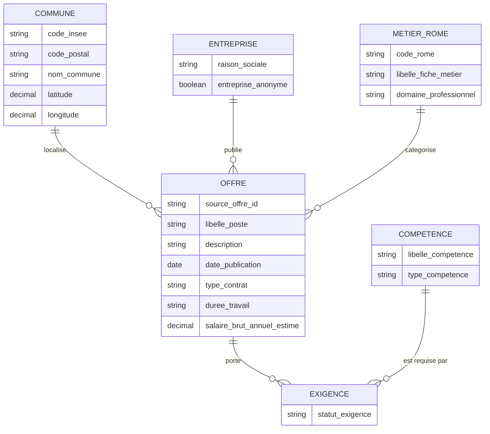
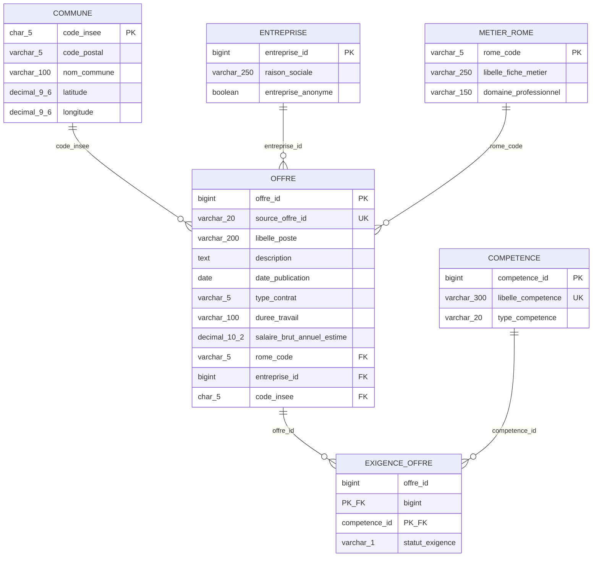

# TP - Audit, cartographie et modélisation de données : tensions sur les compétences numériques

## En bref (à lire en premier)

**De quoi parle ce projet ?** On récupère de vraies offres d'emploi publiées
par France Travail pour savoir **quelles compétences numériques sont les plus
recherchées, et où en France**.

Le projet se fait en deux temps :

| Partie | Ce qu'on fait | Où le lire |
|---|---|---|
| **TP1** | On étudie les données et on dessine la base de données : quelles tables, quelles colonnes, quels liens. | Sections 1 à 7 |
| **TP2** | On construit une chaîne automatique qui collecte, nettoie, stocke et affiche les offres. | Section 8 |

**Pour tout lancer rapidement :**

1. Installer et démarrer [Docker Desktop](https://www.docker.com/products/docker-desktop/).
2. Copier `.env.example` en `.env` et remplir les mots de passe et les identifiants France Travail.
3. Lancer `docker compose up -d --build`.
4. Ouvrir <http://localhost:3000> (Metabase, graphiques métier) et
   <http://localhost:3001> (Grafana, surveillance technique).

La liste complète des adresses, avec ce que vous devez y voir, est dans
[la section 8](#les-adresses-à-ouvrir-dans-le-navigateur).

## Architecture du projet

```text
TP_Cours_Audit_Cartographie_SQL/
├── README.md                 # Dossier complet du TP (ce fichier)
├── docker-compose.yml        # Plateforme TP2 complète orchestrée par Docker
├── docker/                   # Images Python et Spark
├── monitoring/               # Prometheus et provisioning Grafana
├── requirements.txt          # Dépendances des services Python
├── requirements-spark.txt    # Dépendances du traitement PySpark
├── .env.example              # Modèle des variables de connexion (sans secret)
├── docs/
│   ├── mcd.mmd               # MCD Merise (diagramme Mermaid, sans FK ni type SQL)
│   ├── mld.mmd               # MLD Merise (diagramme Mermaid, avec FK et type SQL)
│   ├── architecture-tp2.mmd  # Architecture complète du pipeline TP2
│   ├── dictionnaire_donnees.md # Dictionnaire autonome TP1/TP2
│   └── model.dbml            # Modèle relationnel importable dans dbdiagram.io
├── sql/
│   ├── 01_schema.sql         # DROP + CREATE TABLE + contraintes + index
│   ├── 02_seed.sql           # Jeu de données de test cohérent
│   ├── 03_queries.sql        # Requêtes d'analyse (tableau de bord RH)
│   └── 04_tp2_additive.sql   # Audit, enrichissement et vues TP2
├── src/
│   ├── connection.py         # Connexion PostgreSQL par variables d'environnement
│   ├── schema.py             # Exécution des scripts SQL depuis Python
│   ├── api_client.py         # Client OAuth2 pour l'API France Travail (offres v2)
│   ├── ingest.py             # Transformation JSON API -> lignes 3NF + chargement
│   └── tp2/                  # Producer, collecte Geo, agrégation, Spark
├── spark/
│   └── run_batch.py          # Point d'entrée spark-submit
├── scripts/
│   ├── inspect_offre.py      # Utilitaire dev : dump JSON brut d'une offre (scripts/output/)
│   └── output/               # Artefacts JSON récupérés localement (non versionnés)
└── main.py                   # Point d'entrée : connexion / --init / --sync-api

```

Chaque couche a une responsabilité unique :
- `docs/` porte la modélisation visuelle, 
- `sql/` porte la définition des données en trois scripts numérotés et rejouables indépendamment, 
- `src/` porte la logique d'accès à la base et à l'API,
- `scripts/` regroupe les utilitaires de développement ponctuels, et
- `main.py` reste un point d'entrée fin, sans logique métier.

## 1. Sujet et problématique métier

### Domaine

Emploi, marché du travail et recrutement.

### Contexte

Les acteurs publics et privés du marché du travail (opérateurs de l'emploi,
collectivités territoriales, cabinets de recrutement) cherchent à comprendre,
en temps quasi réel, quelles compétences numériques sont les plus recherchées
et sur quels territoires. Les offres d'emploi diffusées par les plateformes
nationales constituent une matière première précieuse, mais elles arrivent
sous forme de flux JSON semi-structurés, imbriqués et hétérogènes, tandis que
les référentiels nationaux de métiers et de géographie sont publiés dans des
formats et des granularités différents.

### Problématique

Comment transformer des flux d'offres d'emploi semi-structurés issus d'une
API et des référentiels nationaux hétérogènes en un entrepôt relationnel en
troisième forme normale, fiable et interrogeable, permettant d'identifier en
temps réel les compétences les plus recherchées par type de contrat et par
bassin d'emploi ?

### Objectif

* Concevoir un dictionnaire de données couvrant l'ensemble des champs
  mobilisés pour la modélisation.
* Formaliser le Modèle Conceptuel des Données et le Modèle Logique des
  Données correspondants.
* Générer le code DBML complet, prêt à être importé dans dbdiagram.io.
* Livrer un script DDL PostgreSQL complet, avec contraintes, index, données
  de test et requêtes d'analyse orientées tableau de bord RH.

## 2. Source de données réelle du TP1

| Nom | Organisation | URL | Format | Nature | Description métier |
|---|---|---|---|---|---|
| API « Offres d'emploi v2 » | France Travail | <https://francetravail.io/produits-partages/catalogue/offres-emploi> | JSON | Semi-structurée, objets imbriqués | Flux d'offres d'emploi avec objets imbriqués `lieuTravail` (commune, code postal, coordonnées GPS), `entreprise`, code et libellé ROME, tableau `competences[]` et bloc `salaire` en texte libre. Source unique et suffisante pour alimenter l'ensemble du schéma 3NF : chaque offre embarque déjà, sous forme dénormalisée, les référentiels métier (ROME) et géographique (commune) nécessaires à son propre classement. |

Le cahier des charges initial envisageait de croiser cette API avec deux
référentiels externes distincts (ROME 4.0 et Base Adresse Nationale/INSEE
au format CSV, publiés sur data.gouv.fr) afin de fiabiliser respectivement
le classement métier et le rattachement géographique. Dans l'implémentation
réelle (`src/ingest.py`), ce croisement s'est avéré inutile : l'API renvoie
déjà, pour chaque offre, un code et un libellé ROME (`romeCode`,
`romeLibelle`) ainsi qu'un code INSEE de commune (`lieuTravail.commune`)
directement exploitables. Les tables `metier_rome` et `commune` sont donc
alimentées par extraction et dédoublonnage depuis ce flux unique, et non
par le chargement d'un fichier CSV externe.

### Points d'audit de la source

* Les objets `entreprise`, `salaire` et `lieuTravail` sont parfois absents
  ou partiellement renseignés.
* Le champ salaire est un texte libre nécessitant un parsing par expression
  régulière pour en extraire une valeur numérique exploitable
  (`parse_salaire_annuel` dans `src/ingest.py`).
* Le tableau `competences[]` peut être vide, contenir des doublons, ou
  mélanger savoir-faire et savoir-être sans distinction explicite.
* Le code postal fourni par `lieuTravail` n'est pas toujours un identifiant
  stable de commune (plusieurs codes postaux par commune ou inversement) :
  seul le code INSEE est retenu comme clé de rattachement géographique
  fiable dans le modèle (`commune.code_insee`).
* Le libellé de domaine professionnel n'étant pas fourni tel quel par
  l'API, il est déduit de la première lettre du code ROME selon la
  nomenclature officielle des 14 grands domaines (`resolve_domaine_professionnel`).

## 3. Dictionnaire de données

Une version autonome de ce dictionnaire, incluant les champs d'audit et
d'enrichissement du TP2, est disponible dans
[`docs/dictionnaire_donnees.md`](docs/dictionnaire_donnees.md).

| Champ | Description fonctionnelle | Type SQL cible | Exemple de valeur | Contraintes & règle métier |
|---|---|---|---|---|
| `offre_id` | Identifiant technique interne de l'offre | `bigint` | `1` | PK générée automatiquement |
| `source_offre_id` | Identifiant de l'offre côté API France Travail | `varchar(20)` | `178XYZW` | NOT NULL, UNIQUE ; garantit la traçabilité avec la source |
| `libelle_poste` | Intitulé du poste proposé | `varchar(200)` | `Data Engineer / DBA PostgreSQL (F/H)` | NOT NULL |
| `description` | Description synthétique de l'offre | `text` | `Au sein du pôle Data, vous concevez...` | Nullable, texte libre |
| `date_publication` | Date de publication de l'offre | `date` | `2026-09-18` | NOT NULL |
| `type_contrat` | Type de contrat proposé | `varchar(5)` | `CDI` | NOT NULL, CHECK IN ('CDI', 'CDD', 'MIS', 'SAI', 'CCE') |
| `duree_travail` | Régime horaire déclaré | `varchar(100)` | `35H Horaires normaux` | Nullable |
| `salaire_brut_annuel_estime` | Salaire brut annuel estimé, extrait du texte libre par parsing | `numeric(10,2)` | `41500.00` | Nullable, CHECK >= 0 |
| `entreprise_id` | Référence à l'entreprise recruteuse | `bigint` | `1` | FK vers `entreprise`, NOT NULL |
| `raison_sociale` | Nom de l'entreprise recruteuse | `varchar(250)` | `TECH INNOVATION` | Nullable si `entreprise_anonyme = true` ; NOT NULL sinon (règle métier appliquée par `CHECK`) |
| `entreprise_anonyme` | Indique si l'entreprise a choisi de rester anonyme dans l'offre | `boolean` | `false` | NOT NULL, défaut `false` |
| `rome_code` | Code du métier ROME associé à l'offre | `varchar(5)` | `M1805` | FK vers `metier_rome`, NOT NULL |
| `libelle_fiche_metier` | Libellé de la fiche métier ROME | `varchar(250)` | `Études et développement informatique` | NOT NULL |
| `domaine_professionnel` | Domaine professionnel de rattachement du métier | `varchar(150)` | `Systèmes d'information et télécommunications` | NOT NULL |
| `libelle_competence` | Libellé de la compétence technique ou comportementale | `varchar(300)` | `Langage SQL` | NOT NULL, UNIQUE |
| `type_competence` | Nature de la compétence | `varchar(20)` | `Savoir-faire` | NOT NULL, CHECK IN ('Savoir-faire', 'Savoir-être') |
| `statut_exigence` | Caractère exigé ou souhaité d'une compétence pour une offre donnée | `varchar(1)` | `E` | NOT NULL, CHECK IN ('E', 'S') |
| `code_insee` | Code officiel INSEE de la commune | `char(5)` | `44172` | PK de `commune`, FK dans `offre`, NOT NULL |
| `code_postal` | Code postal associé à la commune | `varchar(5)` | `44980` | NOT NULL |
| `nom_commune` | Libellé officiel de la commune | `varchar(100)` | `Sainte-Luce-sur-Loire` | NOT NULL |
| `latitude` | Latitude du centroïde de la commune | `numeric(9,6)` | `47.249400` | Nullable, CHECK entre -90 et 90 |
| `longitude` | Longitude du centroïde de la commune | `numeric(9,6)` | `-1.486200` | Nullable, CHECK entre -180 et 180 |

## 4. Identification des entités, cardinalités et justification

### Entités retenues

* **COMMUNE** : bassin d'emploi identifié par le code INSEE.
* **ENTREPRISE** : entité recruteuse, pouvant être anonyme dans l'offre
  publiée.
* **METIER_ROME** : référentiel des métiers, garantissant un classement
  stable des offres.
* **COMPETENCE** : référentiel des compétences techniques et
  comportementales, dédoublonné.
* **OFFRE** : table de faits centrale portant les caractéristiques propres à
  chaque offre d'emploi.
* **EXIGENCE_OFFRE** : table d'association entre `OFFRE` et `COMPETENCE`,
  porteuse de l'attribut `statut_exigence`.

### Cardinalités et justifications

| Relation | Cardinalité | Justification métier |
|---|---|---|
| `COMMUNE` localise `OFFRE` | COMMUNE `1,1` — OFFRE `0,N` | Chaque offre est publiée pour un unique bassin d'emploi identifié par son code INSEE (`code_insee` est NOT NULL dans `OFFRE`) ; une commune peut ne recevoir aucune offre sur la période observée ou en recevoir plusieurs. Le code INSEE, plutôt que le code postal ou le libellé, est retenu comme clé car il est stable et sans ambiguïté, contrairement au code postal qui peut être partagé par plusieurs communes ou inversement. |
| `ENTREPRISE` publie `OFFRE` | ENTREPRISE `1,1` — OFFRE `0,N` | Chaque offre est rattachée à une entreprise recruteuse, même lorsque celle-ci choisit de rester anonyme : dans ce cas, `entreprise_id` reste renseigné mais `raison_sociale` est laissé à `NULL` et `entreprise_anonyme` passe à `true`. Une entreprise peut publier plusieurs offres ou n'en publier aucune sur le périmètre observé. Cette modélisation évite de perdre l'information de regroupement des offres d'une même entreprise anonyme tout en respectant la confidentialité demandée. |
| `METIER_ROME` catégorise `OFFRE` | METIER_ROME `1,1` — OFFRE `0,N` | Chaque offre est rattachée à un unique code ROME, permettant de comparer objectivement des offres provenant d'entreprises différentes sur un même métier ; un métier du référentiel peut ne correspondre à aucune offre observée. |
| `OFFRE` requiert `COMPETENCE` | OFFRE `0,N` — COMPETENCE `0,N`, via `EXIGENCE_OFFRE` | La relation entre une offre et les compétences attendues est intrinsèquement plusieurs-à-plusieurs : une offre mentionne généralement plusieurs compétences, et une compétence donnée (par exemple « Langage SQL ») est demandée par de nombreuses offres différentes. Une relation binaire directe entre `OFFRE` et `COMPETENCE` ne permettrait pas de conserver l'information de statut (« Exigé » ou « Souhaité ») associée à chaque paire offre/compétence ; la table de liaison `EXIGENCE_OFFRE` est donc indispensable pour porter cet attribut sans redondance et sans violer la troisième forme normale. La cardinalité minimale « une offre doit posséder au moins une compétence » ne peut pas être imposée par une simple clé étrangère dans un modèle relationnel standard ; elle est donc contrôlée en amont par le processus d'extraction et de chargement (ETL), qui rejette ou signale toute offre sans compétence extraite. |

### Gestion des cas particuliers

* **Entreprises anonymes** : l'anonymat est un attribut de l'entreprise et
  non de l'offre, car une même entreprise anonyme peut publier plusieurs
  offres sous la même identité masquée. La contrainte `CHECK` garantit qu'une
  entreprise non anonyme possède obligatoirement une raison sociale, et
  qu'une entreprise anonyme peut légitimement avoir une raison sociale
  absente.
* **Communes sans coordonnées GPS** : le bloc `lieuTravail` de l'API ne
  fournit pas systématiquement de coordonnées précises pour chaque commune ;
  `latitude` et `longitude` restent donc nullables, sans remettre en cause
  l'usage du code INSEE comme identifiant géographique principal.

## 5. Modélisation conceptuelle et logique

### Modèle Conceptuel des Données (description textuelle)

Une `COMMUNE`, identifiée par son code INSEE, peut localiser plusieurs
`OFFRE`. Une `ENTREPRISE`, anonyme ou non, peut publier plusieurs `OFFRE`.
Chaque `OFFRE` est rattachée à un unique `METIER_ROME` du référentiel. Chaque
`OFFRE` peut requérir plusieurs `COMPETENCE`, et chaque `COMPETENCE` peut être
requise par plusieurs `OFFRE` ; cette relation plusieurs-à-plusieurs est
portée par l'association `EXIGENCE_OFFRE`, qui qualifie chaque lien par un
statut d'exigence (« Exigé » ou « Souhaité »). Les attributs propres à
l'offre (libellé, description, date de publication, type de contrat, durée
de travail, salaire estimé) ne sont stockés qu'une seule fois, dans
`OFFRE`, car ils dépendent uniquement de l'identifiant de l'offre.

### Modèle Conceptuel des Données (schéma)

Représentation Merise : entités porteuses de leurs seuls attributs
fonctionnels (sans clé étrangère ni type SQL, conformément au MCD),
relations nommées par un verbe métier et qualifiées par leurs cardinalités
minimale et maximale de chaque côté. L'association `EXIGENCE`, porteuse de
l'attribut `statut_exigence`, matérialise la relation plusieurs-à-plusieurs
entre `OFFRE` et `COMPETENCE`.



*Note de lecture Merise : les cardinalités portées sur le schéma sont
`1,1` côté entité porteuse (`COMMUNE`, `ENTREPRISE`, `METIER_ROME`, `OFFRE`,
`COMPETENCE`) et `0,N` côté entité dépendante, conformément au tableau des
cardinalités ci-dessus. La notation Mermaid `||--o{` traduit ce couple
« exactement un » / « zéro ou plusieurs ».*

Ce diagramme est également disponible en fichier autonome dans
[`docs/mcd.mmd`](docs/mcd.mmd), à coller directement sur
<https://mermaid.live> ou à ouvrir dans un éditeur supportant Mermaid.

### Modèle Logique des Données (schéma)

Représentation avec clés primaires, clés étrangères et types SQL cibles,
conformément au script `sql/01_schema.sql`. Contrairement au MCD, la
relation plusieurs-à-plusieurs est ici matérialisée par la table physique
`EXIGENCE_OFFRE`, porteuse de sa propre clé primaire composée.



Ce diagramme est également disponible en fichier autonome dans
[`docs/mld.mmd`](docs/mld.mmd), à coller directement sur
<https://mermaid.live> ou à ouvrir dans un éditeur supportant Mermaid.

Convention de lecture : les clés primaires sont indiquées par `PK`, les
clés étrangères sont préfixées par `#` et fléchées vers la table
référencée. Le modèle respecte la troisième forme normale : chaque attribut
non-clé dépend de la totalité de la clé primaire de sa table et d'aucun
autre attribut, les référentiels (`METIER_ROME`, `COMPETENCE`, `COMMUNE`,
`ENTREPRISE`) sont séparés de la table de faits `OFFRE`, et la relation
plusieurs-à-plusieurs est résolue par `EXIGENCE_OFFRE`.

## 6. Script d'implémentation PostgreSQL

Le script est découpé en trois fichiers numérotés et rejouables dans l'ordre,
disponibles dans le dossier [`sql/`](sql) :

| Fichier | Rôle |
|---|---|
| [`sql/01_schema.sql`](sql/01_schema.sql) | `DROP TABLE IF EXISTS ... CASCADE` dans l'ordre inverse des dépendances, puis création des six tables avec types stricts (`BIGINT` en identité, `VARCHAR`, `NUMERIC`, `DATE`, `BOOLEAN`, `CHAR`), clés primaires, clés étrangères avec `ON DELETE RESTRICT/CASCADE` et `ON UPDATE CASCADE`, contraintes `CHECK` de validation (format du code INSEE, type de contrat autorisé, salaire positif, cohérence de l'anonymat des entreprises), et huit index B-Tree ciblant les colonnes de jointure et de filtrage les plus fréquentes. |
| [`sql/02_seed.sql`](sql/02_seed.sql) | Jeu de données de test cohérent : deux communes, deux entreprises (dont une anonyme), deux fiches ROME, quatre compétences, trois offres et leurs liaisons de compétences avec statut d'exigence. |
| [`sql/03_queries.sql`](sql/03_queries.sql) | Deux requêtes SQL avancées orientées tableau de bord RH. |

### Aperçu des requêtes d'analyse

```sql
-- Requête 1 : compétences attendues par offre, avec métier ROME,
-- type de contrat et bassin d'emploi (STRING_AGG).
SELECT
    o.source_offre_id,
    o.libelle_poste,
    mr.libelle_fiche_metier,
    o.type_contrat,
    nc.nom_commune,
    STRING_AGG(
        c.libelle_competence || ' (' || eo.statut_exigence || ')',
        ', ' ORDER BY eo.statut_exigence, c.libelle_competence
    ) AS competences_attendues
FROM offre o
JOIN metier_rome mr    ON mr.rome_code = o.rome_code
JOIN commune nc        ON nc.code_insee = o.code_insee
JOIN exigence_offre eo ON eo.offre_id = o.offre_id
JOIN competence c      ON c.competence_id = eo.competence_id
GROUP BY o.offre_id, o.source_offre_id, o.libelle_poste,
         mr.libelle_fiche_metier, o.type_contrat, nc.nom_commune
ORDER BY o.date_publication DESC;
```

```sql
-- Requête 2 : tension du marché par bassin d'emploi et type de contrat,
-- avec salaire moyen estimé (AVG) et compétences exigées associées.
SELECT
    c.nom_commune,
    o.type_contrat,
    COUNT(DISTINCT o.offre_id)                       AS nombre_offres,
    ROUND(AVG(o.salaire_brut_annuel_estime), 2)      AS salaire_moyen_estime,
    STRING_AGG(DISTINCT comp.libelle_competence, ', ' ORDER BY comp.libelle_competence)
                                                       AS competences_demandees
FROM offre o
JOIN commune c              ON c.code_insee = o.code_insee
JOIN exigence_offre eo       ON eo.offre_id = o.offre_id
JOIN competence comp         ON comp.competence_id = eo.competence_id
WHERE eo.statut_exigence = 'E'
GROUP BY c.nom_commune, o.type_contrat
ORDER BY nombre_offres DESC, salaire_moyen_estime DESC;
```

## 7. Cartographie globale du pipeline de données

```text
API France Travail (JSON, offres avec ROME et commune imbriqués)
                                                    |
                                                    v
                         Zone brute (réponses JSON horodatées)
                                                    |
                                                    v
                        Audit qualité et nettoyage (data wrangling)
    (aplatissement du tableau competences[], parsing regex du salaire
     en texte libre, dédoublonnage des compétences, traitement explicite
     des entreprises anonymes, extraction du code ROME et du code INSEE
     directement depuis le JSON de chaque offre)
                                                    |
                                                    v
                    Normalisation et structuration en 3NF
   (commune, entreprise, metier_rome, competence, offre, exigence_offre)
                                                    |
                                                    v
                        Stockage PostgreSQL contraint et indexé
                                                    |
                          +-------------------------+-------------------------+
                          v                                                   v
                Exploitation BI / Metabase                          Pilotage RH et territorial
        tableaux de bord de tension par métier               détection des bassins en tension,
        et par bassin d'emploi                                aide au sourcing de compétences
```

### Détail des quatre étapes

1. **Extraction** : interroger périodiquement l'API « Offres d'emploi v2 »
   de France Travail (authentification OAuth2). Chaque offre embarque déjà,
   sous forme imbriquée, son code et libellé ROME ainsi que sa commune de
   rattachement : aucun référentiel externe supplémentaire n'est nécessaire.
   Les réponses JSON brutes sont conservées telles quelles, avec horodatage
   de collecte, avant toute transformation (voir `scripts/inspect_offre.py`
   pour l'inspection manuelle d'une offre brute).

2. **Audit et nettoyage (data wrangling)** : profiler la présence ou
   l'absence des objets imbriqués (`entreprise`, `lieuTravail`, `salaire`) ;
   aplatir le tableau `competences[]` en une ligne par compétence et par
   offre ; extraire une valeur numérique de salaire à partir du texte libre
   par expression régulière (par exemple `Annuel de 38000.0 Euros à 45000.0
   Euros` devient une valeur médiane estimée) ; dédupliquer les libellés de
   compétences afin d'éviter la création de doublons dans le référentiel ;
   traiter explicitement le cas des entreprises anonymes en distinguant
   absence de nom et confidentialité volontaire ; rejeter et journaliser
   toute offre dont le code ROME, la commune, la date de publication ou le
   type de contrat sont manquants ou non conformes aux contraintes du
   schéma.

3. **Normalisation et structuration** : construire les tables de
   référentiel (`commune`, `entreprise`, `metier_rome`, `competence`)
   dédupliquées, puis alimenter la table de faits `offre` en ne conservant
   qu'une ligne par identifiant source d'offre, et enfin peupler la table
   d'association `exigence_offre` afin de représenter la relation
   plusieurs-à-plusieurs entre offres et compétences, sans redondance et en
   respectant la troisième forme normale.

4. **Stockage et exploitation** : charger l'ensemble en transaction dans
   PostgreSQL, vérifier la satisfaction de toutes les contraintes
   d'intégrité et l'efficacité des index de jointure, puis exposer les
   données à des outils de restitution tels que Metabase ou tout autre
   outil de Business Intelligence pour construire des tableaux de bord de
   pilotage RH : compétences les plus demandées par métier et par bassin
   d'emploi, salaire moyen estimé par type de contrat, et suivi dans le
   temps des tensions de recrutement territoriales.

## Installation et exécution

### Prérequis

* PostgreSQL 14 ou supérieur, accessible en local ou à distance.
* Python 3.11 ou supérieur.
* Des identifiants applicatifs [francetravail.io](https://francetravail.io)
  (uniquement nécessaires pour l'ingestion réelle décrite plus bas).

### 1. Installer les dépendances

```bash
python -m pip install -r requirements.txt
```

### 2. Configurer la connexion

Copier `.env.example` en `.env` et renseigner au minimum les variables
PostgreSQL (`PGHOST`, `PGPORT`, `PGDATABASE`, `PGUSER`, `PGPASSWORD`). Le
fichier `.env` est ignoré par git : aucun secret n'est jamais committé.
Il est chargé automatiquement par `main.py`.

### 3. Initialiser le schéma et les données de test

#### Option A : Avec Docker Compose (recommandé pour une évaluation sans installation locale)

Une seule commande démarre PostgreSQL, crée le schéma et injecte les données de test :
```bash
docker compose up -d
```
PostgreSQL tourne dans le conteneur `postgres_emploi` (image `postgres:16-alpine`).
Ses données sont stockées dans le volume Docker
`tp_cours_audit_cartographie_sql_pgdata`. Les scripts `sql/01_schema.sql`,
`sql/02_seed.sql` et `sql/04_tp2_additive.sql` ne sont exécutés qu'au premier
démarrage, quand ce volume est encore vide.

Pour réinitialiser complètement la base Docker depuis zéro (supprime les volumes) :
```bash
docker compose down -v && docker compose up -d
```

#### Option B : Avec Python (base locale ou conteneur Docker)

```bash
python main.py            # affiche l'état de connexion, la volumétrie des 6 tables
                          # et un aperçu des dernières offres enregistrées en base
python main.py --init     # recrée le schéma (sql/01_schema.sql)
                          # et charge le jeu de données de test (sql/02_seed.sql)
```

#### Option C : Avec le client `psql`

En exécutant les scripts dans l'ordre (chacun est autonome et rejouable grâce aux `DROP TABLE IF EXISTS ... CASCADE` du premier fichier) :

```bash
psql -d emploi -f sql/01_schema.sql
psql -d emploi -f sql/02_seed.sql
psql -d emploi -f sql/03_queries.sql
```

### 4. Ingérer des offres réelles depuis l'API France Travail

Le module `src/api_client.py` gère l'authentification OAuth2 (flux `client_credentials`) et `src/ingest.py` transforme les offres JSON reçues en lignes conformes au schéma 3NF (parsing du salaire en texte libre, gestion de l'anonymat d'entreprise, upsert idempotent des référentiels commune/ROME/compétence).

Compléter dans `.env` les variables `FT_*` décrites dans `.env.example` (identifiant, secret, endpoint de jeton, scope, URL de l'API), puis lancer l'ingestion :

```bash
# 1. Recherche ciblée sur une tranche (par défaut 0-49)
python main.py --sync-api --mots-cles "data engineer" --code-rome M1805 --commune 44172

# 2. Recherche ciblée avec pagination automatique (jusqu'à 1 149 offres max)
python main.py --sync-api --mots-cles "data analyst" --departement 75 --paginate

# 3. Collecte globale sur l'ensemble des 101 départements français
python main.py --sync-all

# 4. Collecte globale filtrée par mots-clés avec limite par département
python main.py --sync-all --mots-cles "data" --max-per-dep 200
```

Chaque exécution est idempotente : les offres déjà connues (`source_offre_id`) sont mises à jour plutôt que dupliquées (`ON CONFLICT DO UPDATE`). Les offres non conformes aux contraintes du schéma (code ROME, commune, date de publication ou type de contrat manquants/invalides) sont écartées et journalisées via `logging`, conformément à l'étape d'audit qualité du pipeline décrite en section 7.

### 5. Inspecter une offre brute (optionnel, développement)

Pour explorer la structure JSON exacte renvoyée par l'API avant d'étendre
`src/ingest.py`, `scripts/inspect_offre.py` réutilise `FranceTravailClient`
et sauvegarde une offre dans `scripts/output/` (dossier ignoré par git) :

```bash
python scripts/inspect_offre.py               # première offre trouvée (motsCles="data")
python scripts/inspect_offre.py 214JMGC       # offre précise par identifiant
```

## 8. TP2 - Plateforme data temps quasi réel

### En une phrase

Le TP2 récupère automatiquement des offres d'emploi, les nettoie, les range
dans PostgreSQL et les affiche dans des tableaux de bord. Tout se lance avec
**une seule commande** Docker.

### Les mots à connaître

| Mot | Explication simple |
|---|---|
| **API** | Un site qui renvoie des données au lieu de pages web. Ici : les offres d'emploi de France Travail. |
| **Docker** | Un outil qui lance chaque programme dans une « boîte » (un conteneur) déjà configurée. Pas besoin d'installer Kafka, Spark, etc. |
| **Image Docker** | Le « modèle » d'un programme, prêt à l'emploi (comme un fichier d'installation). Elle ne contient pas vos données. |
| **Conteneur Docker** | Un programme **en marche**, lancé à partir d'une image. |
| **Volume Docker** | Un espace de stockage géré par Docker, où les conteneurs gardent leurs **données**. Il survit à l'arrêt des conteneurs. |
| **Montage local (bind mount)** | Un fichier ou dossier **du projet** rendu visible dans un conteneur (configurations, scripts SQL). |
| **Kafka** | Une « boîte aux lettres » : le producteur y dépose les offres, un autre programme vient les chercher. |
| **Data Lake** | Un dossier où l'on garde **toutes** les données brutes, sans rien effacer, pour pouvoir tout rejouer. |
| **PySpark** | L'outil qui nettoie les données (champs vides, doublons, types). |
| **PostgreSQL** | La base de données finale, propre et organisée en tables. |
| **Metabase** | L'outil de graphiques pour lire les données métier (offres, compétences, villes). |
| **Prometheus** | Il relève régulièrement des chiffres techniques sur chaque service (est-il en marche ? combien de messages ?). |
| **Grafana** | Il affiche ces chiffres techniques en graphiques pour surveiller la plateforme. |

### Les deux sources de données

| Source | Ce qu'elle apporte | Comment on la récupère | Où elle arrive |
|---|---|---|---|
| **API France Travail** « Offres d'emploi v2 » | Les offres d'emploi : métier, contrat, salaire, compétences, commune. | Le programme `ft-producer` l'interroge toutes les 15 minutes (compte France Travail nécessaire). | Kafka, dans le topic `france-travail.offres.raw`. |
| **API Géo** du gouvernement (`geo.api.gouv.fr/communes`) | La liste officielle des communes : nom, codes postaux, coordonnées GPS. | Le programme `communes-collector` la télécharge une fois par jour (sans compte). | Data Lake, dossier `raw/communes/`. |

**Pourquoi les deux ?** Chaque offre contient un code de commune (code INSEE).
On s'en sert pour relier l'offre à la fiche officielle de la commune, et ainsi
corriger ou compléter le nom de la ville et sa position GPS.

### Le trajet d'une offre, étape par étape

```text
1. COLLECTER    ft-producer récupère les offres sur l'API France Travail
       ↓
2. TRANSPORTER  les offres sont déposées dans Kafka
       ↓
3. STOCKER      raw-aggregator les copie telles quelles dans le Data Lake (raw/)
                puis les relie aux communes officielles (aggregated/)
       ↓
4. TRANSFORMER  spark-batch (PySpark) nettoie : champs obligatoires, doublons, types
                les offres invalides sont mises de côté dans quarantine/
       ↓
5. CHARGER      les offres propres sont enregistrées dans PostgreSQL (tables du TP1)
       ↓
6. VISUALISER   Metabase affiche les offres, compétences et villes
       ↓
7. SUPERVISER   Prometheus + Grafana vérifient que tout fonctionne
                et comparent le nombre d'offres brutes et propres
```

Le schéma complet est dans [`docs/architecture-tp2.mmd`](docs/architecture-tp2.mmd).

Organisation du Data Lake. Ce n'est **pas** un dossier du projet : c'est le
**volume Docker** `tp_cours_audit_cartographie_sql_data_lake`, visible dans
les conteneurs sous le chemin `/data-lake` :

```text
data-lake/
├── raw/
│   ├── france_travail/   # offres brutes, exactement comme reçues
│   └── communes/         # référentiel officiel des communes
├── aggregated/offres/    # offres + infos de la commune officielle
├── curated/offres/       # offres nettoyées par PySpark (format Parquet)
└── quarantine/spark/     # offres rejetées, avec la raison du rejet
```

Le Data Lake ne contient **pas de code**, seulement des **fichiers de
données**, dans trois formats :

| Dossier | Format | Contenu | Écrit par | Exemple de fichier |
|---|---|---|---|---|
| `raw/france_travail/` | **JSON**, un fichier par offre | L'offre brute, exactement comme reçue de Kafka | `raw_aggregator_tp2` (Python) | `ingestion_date=2026-09-25/bbdcb3ae-….json` |
| `raw/communes/` | **JSON**, un fichier par collecte | La liste des communes de l'API Géo | `communes_collector_tp2` (Python) | `ingestion_date=2026-09-25/communes_20260925T085832_594092Z.json` et `_latest.json` (copie de la dernière collecte) |
| `aggregated/offres/` | **JSONL**, une offre par ligne | L'offre et la fiche de sa commune officielle | `raw_aggregator_tp2` (Python) | `ingestion_date=2026-09-25/part-50e0a1ec-….jsonl` |
| `curated/offres/` | **Parquet** compressé Snappy | Les offres nettoyées, en colonnes typées | `spark_batch_tp2` (PySpark) | `run_id=…/part-00000-….snappy.parquet` |
| `quarantine/spark/` | **JSON Lines**, une offre rejetée par ligne | Les offres rejetées et la raison du rejet | `spark_batch_tp2` (PySpark) | `run_id=…/part-00000-….json` |

Comment lire ces fichiers :

* **JSON / JSONL** : du texte lisible dans n'importe quel éditeur, par exemple
  `{"event_id": "...", "payload": {...}}`. En JSONL, chaque ligne est un objet
  JSON complet.
* **Parquet** : un format binaire rangé par colonnes, très rapide pour Spark.
  Il ne se lit pas dans un éditeur de texte : il faut passer par Spark, pandas
  ou DuckDB.
* **Fichiers `_SUCCESS` et `.crc`** : Spark les crée automatiquement.
  `_SUCCESS` signale que l'écriture est terminée, et les `.crc` servent à
  vérifier que les fichiers ne sont pas corrompus.
* **Dossiers `ingestion_date=…` et `run_id=…`** : ils classent les fichiers
  par jour de collecte ou par passage de Spark (on parle de *partitions*).

À chaque passage, Spark note dans la table `tp2_pipeline_run` le nombre
d'offres **brutes** (`raw_count`), **propres** (`clean_count`) et
**rejetées** (`rejected_count`). C'est l'indicateur « Raw vs Clean ».

### Lancer la plateforme

**Prérequis :** Docker Desktop installé et démarré.

1. Copier le fichier d'exemple de configuration :

   ```bash
   cp .env.example .env
   ```

2. Ouvrir `.env` et remplir au minimum :
   * `PGPASSWORD` : mot de passe de la base (par exemple `postgres`) ;
   * `FT_CLIENT_ID` et `FT_CLIENT_SECRET` : identifiants obtenus sur
     [francetravail.io](https://francetravail.io). Sans eux, tout démarre
     mais aucune offre réelle n'est récupérée.

3. Lancer tout :

   ```bash
   docker compose up -d --build
   ```

4. Vérifier que tout tourne (colonne `STATUS` à `Up` ou `healthy`) :

   ```bash
   docker compose ps
   ```

Le premier démarrage prend quelques minutes (téléchargement des images).

### Où se trouve quoi dans Docker

Les noms commençant par `tp_cours_audit_cartographie_sql` sont créés
automatiquement par Docker Compose à partir du nom du dossier du projet.
Dans Docker Desktop, ils sont visibles dans les onglets *Containers*,
*Images* et *Volumes*.

#### Conteneurs et images

| Rôle | Service Compose | Nom complet du conteneur | Image | Origine de l'image |
|---|---|---|---|---|
| Base de données | `postgres` | `postgres_emploi` | `postgres:16-alpine` | Téléchargée (Docker Hub) |
| Kafka (boîte aux lettres) | `kafka` | `kafka_tp2` | `apache/kafka:3.7.1` | Téléchargée |
| Création du topic Kafka (s'arrête après) | `kafka-init` | `tp_cours_audit_cartographie_sql-kafka-init-1` | `apache/kafka:3.7.1` | Téléchargée |
| Interface Kafka | `kafka-ui` | `kafka_ui_tp2` | `provectuslabs/kafka-ui:v0.7.2` | Téléchargée |
| Source 1 : collecte France Travail | `ft-producer` | `ft_producer_tp2` | `tp_cours_audit_cartographie_sql-ft-producer` | **Construite** par le projet (`docker/Dockerfile.python`) |
| Source 2 : collecte des communes | `communes-collector` | `communes_collector_tp2` | `tp_cours_audit_cartographie_sql-communes-collector` | **Construite** (`docker/Dockerfile.python`) |
| Agrégation Kafka → Data Lake | `raw-aggregator` | `raw_aggregator_tp2` | `tp_cours_audit_cartographie_sql-raw-aggregator` | **Construite** (`docker/Dockerfile.python`) |
| Nettoyage PySpark → PostgreSQL | `spark-batch` | `spark_batch_tp2` | `tp_cours_audit_cartographie_sql-spark-batch` | **Construite** (`docker/Dockerfile.spark`) |
| Graphiques métier | `metabase` | `metabase_tp2` | `metabase/metabase:v0.50.18` | Téléchargée |
| Configuration auto de Metabase (optionnel, s'arrête après) | `metabase-setup` | `tp_cours_audit_cartographie_sql-metabase-setup-1` | `tp_cours_audit_cartographie_sql-metabase-setup` | **Construite** (`docker/Dockerfile.python`) |
| Métriques PostgreSQL | `postgres-exporter` | `postgres_exporter_tp2` | `prometheuscommunity/postgres-exporter:v0.15.0` | Téléchargée |
| Métriques Kafka | `kafka-exporter` | `kafka_exporter_tp2` | `danielqsj/kafka-exporter:v1.7.0` | Téléchargée |
| Collecte des métriques | `prometheus` | `prometheus_tp2` | `prom/prometheus:v2.53.1` | Téléchargée |
| Graphiques techniques | `grafana` | `grafana_tp2` | `grafana/grafana:11.1.4` | Téléchargée |
| CPU / mémoire des conteneurs | `cadvisor` | `cadvisor_tp2` | `gcr.io/cadvisor/cadvisor:v0.49.1` | Téléchargée (Google) |

#### Volumes (là où sont les données)

| Nom complet du volume | Chemin dans le conteneur | Utilisé par | Contenu |
|---|---|---|---|
| `tp_cours_audit_cartographie_sql_pgdata` | `/var/lib/postgresql/data` | `postgres_emploi` | Toutes les tables PostgreSQL (offres, compétences, communes, suivi du pipeline). |
| `tp_cours_audit_cartographie_sql_kafka_data` | `/var/lib/kafka/data` | `kafka_tp2` | Les messages Kafka (offres en transit). |
| `tp_cours_audit_cartographie_sql_data_lake` | `/data-lake` | `communes_collector_tp2`, `raw_aggregator_tp2`, `spark_batch_tp2` | Le **Data Lake** : `raw/`, `aggregated/`, `curated/`, `quarantine/`. |
| `tp_cours_audit_cartographie_sql_metabase_data` | `/metabase-data` | `metabase_tp2` | Comptes, connexions et dashboards Metabase. |
| `tp_cours_audit_cartographie_sql_grafana_data` | `/var/lib/grafana` | `grafana_tp2` | Réglages et comptes Grafana. |

Pour regarder le contenu d'un volume, par exemple le Data Lake :

* **Docker Desktop** : *Volumes* → `tp_cours_audit_cartographie_sql_data_lake` → onglet *Data* ;
* **ligne de commande** : `docker exec raw_aggregator_tp2 ls -R /data-lake`.

#### Fichiers du projet montés dans les conteneurs

Ces fichiers restent dans le dépôt Git. Les conteneurs les lisent sans pouvoir les modifier.

| Fichier ou dossier du projet | Chemin dans le conteneur | Conteneur | Rôle |
|---|---|---|---|
| `sql/01_schema.sql`, `sql/02_seed.sql`, `sql/04_tp2_additive.sql` | `/docker-entrypoint-initdb.d/` | `postgres_emploi` | Création des tables au **premier** démarrage de la base. |
| `monitoring/prometheus.yml` | `/etc/prometheus/prometheus.yml` | `prometheus_tp2` | Liste des services à surveiller. |
| `monitoring/postgres_exporter_queries.yaml` | `/etc/postgres_exporter/queries.yaml` | `postgres_exporter_tp2` | Requêtes qui calculent les compteurs Raw / Clean. |
| `monitoring/grafana/provisioning/` | `/etc/grafana/provisioning` | `grafana_tp2` | Connexion automatique de Grafana à Prometheus. |
| `monitoring/grafana/dashboards/` | `/var/lib/grafana/dashboards` | `grafana_tp2` | Dashboard **TP2 Data Platform Overview**. |

#### Réseau

Tous les conteneurs communiquent sur le réseau Docker
`tp_cours_audit_cartographie_sql_default`. Entre eux, ils s'appellent par leur
**nom de service** (`postgres`, `kafka`…). C'est pour cela que Metabase se
connecte à l'hôte `postgres` et non à `localhost`.

### Les adresses à ouvrir dans le navigateur

| Service | URL | À quoi ça sert | Ce que vous devez voir | Identifiants |
|---|---|---|---|---|
| **Metabase** | <http://localhost:3000> | Tableau de bord **métier** : lire les offres d'emploi. | Le dashboard **TP2 - Marché de l'emploi** : offres par contrat, compétences les plus demandées, offres par ville, compteurs brut / propre. | Compte créé au premier lancement. |
| **Grafana** | <http://localhost:3001> | Tableau de bord **technique** : surveiller la plateforme. | Menu *Dashboards* → **TP2 Data Platform Overview** : services en marche, flux Kafka, activité PostgreSQL, courbe Raw vs Clean vs Rejected. | `admin` / `admin` |
| **Kafka UI** | <http://localhost:8080> | Voir les messages qui passent dans Kafka. | Menu *Topics* → `france-travail.offres.raw` : le nombre de messages augmente à chaque collecte ; onglet *Messages* pour lire une offre. | Aucun |
| **Prometheus** | <http://localhost:9090> | Vérifier que chaque service est bien surveillé. | Menu *Status* → *Targets* : toutes les lignes doivent être **UP** (en vert). | Aucun |
| **cAdvisor** | <http://localhost:8081> | Consommation CPU et mémoire de chaque conteneur. | La liste des conteneurs Docker avec leurs graphiques CPU / mémoire. | Aucun |
| Métriques producteur | <http://localhost:8001/metrics> | Chiffres bruts du programme qui interroge France Travail. | Une page de texte avec le nombre d'offres récupérées et envoyées dans Kafka. | Aucun |
| Métriques communes | <http://localhost:8002/metrics> | Chiffres bruts du programme qui télécharge les communes. | Une page de texte indiquant si le référentiel des communes est disponible et combien il en contient. | Aucun |
| Métriques agrégateur | <http://localhost:8003/metrics> | Chiffres bruts du programme qui lit Kafka et écrit dans le Data Lake. | Une page de texte avec le nombre d'offres lues, écrites et reliées à une commune. | Aucun |
| Métriques PostgreSQL | <http://localhost:9187/metrics> | Chiffres bruts de la base de données. | Une page de texte ; la ligne `pg_up 1` signifie que la base répond. | Aucun |
| Métriques Kafka | <http://localhost:9308/metrics> | Chiffres bruts de Kafka. | Une page de texte avec les topics et le nombre de messages. | Aucun |

Les pages `/metrics` ne sont pas faites pour être lues par un humain : elles
sont lues automatiquement par Prometheus, puis affichées en graphiques dans
Grafana.

### Configurer Metabase

**Option automatique (recommandée).** Mettre dans `.env` l'e-mail et le mot
de passe du compte Metabase (`MB_ADMIN_EMAIL`, `MB_ADMIN_PASSWORD`), puis :

```bash
docker compose --profile metabase-setup up metabase-setup
```

Cela crée la connexion à la base, quatre graphiques et le dashboard
**TP2 - Marché de l'emploi**.

**Option manuelle.** Dans Metabase : *Admin* → *Bases de données* →
*Ajouter une base de données* → PostgreSQL :

| Champ | Valeur | Pourquoi |
|---|---|---|
| Nom affiché | `TP2 PostgreSQL` | Libre, juste pour s'y retrouver. |
| Hôte | `postgres` | Metabase tourne dans Docker : il faut le **nom du service**, pas `localhost`. |
| Port | `5432` | Port standard de PostgreSQL. |
| Base de données | valeur de `PGDATABASE` dans `.env` (ex. `emploie`) | Nom de la base créée par Docker. |
| Utilisateur | `postgres` | Attention au remplissage automatique du navigateur. |
| Mot de passe | valeur de `PGPASSWORD` dans `.env` | Même mot de passe que la base. |

La base **Sample Database** visible dans Metabase est un exemple fourni par
Metabase : elle n'a rien à voir avec le TP et peut être supprimée.

### Démonstration rapide

1. `docker compose up -d --build`, puis `docker compose ps`.
2. **Kafka UI** : le topic `france-travail.offres.raw` contient des messages.
3. Lancer tout de suite un nettoyage Spark, sans attendre 30 minutes :

   ```bash
   docker compose run --rm -e SPARK_BATCH_RUN_ONCE=true spark-batch
   ```

4. **Metabase** : les offres apparaissent dans le dashboard.
5. **Grafana** : les services sont verts et la courbe Raw vs Clean montre
   combien d'offres brutes sont devenues des offres propres.

Pour une démo plus rapide, baisser dans `.env`
`FT_PRODUCER_POLL_INTERVAL_SECONDS` (fréquence de collecte, en secondes) et
`SPARK_BATCH_INTERVAL_SECONDS` (fréquence du nettoyage), puis relancer
`docker compose up -d`.

### Commandes utiles

| Besoin | Commande |
|---|---|
| Voir l'état des services | `docker compose ps` |
| Lire les journaux d'un service | `docker compose logs -f ft-producer` |
| Arrêter la plateforme (données conservées) | `docker compose down` |
| Tout effacer et repartir de zéro | `docker compose down -v` puis `docker compose up -d --build` |
| Lancer les tests | `python -m unittest discover -s tests -t . -v` |
| Vérifier le fichier Docker Compose | `docker compose config --quiet` |

`docker compose down -v` supprime **toutes** les données, c'est-à-dire les
5 volumes `tp_cours_audit_cartographie_sql_pgdata`, `_kafka_data`,
`_data_lake`, `_metabase_data` et `_grafana_data`. Les images et les fichiers
du projet sont conservés. Les données générées (`data-lake/`, `*.jsonl`,
`*.parquet`, `scripts/output/`) ne sont jamais envoyées sur Git.
