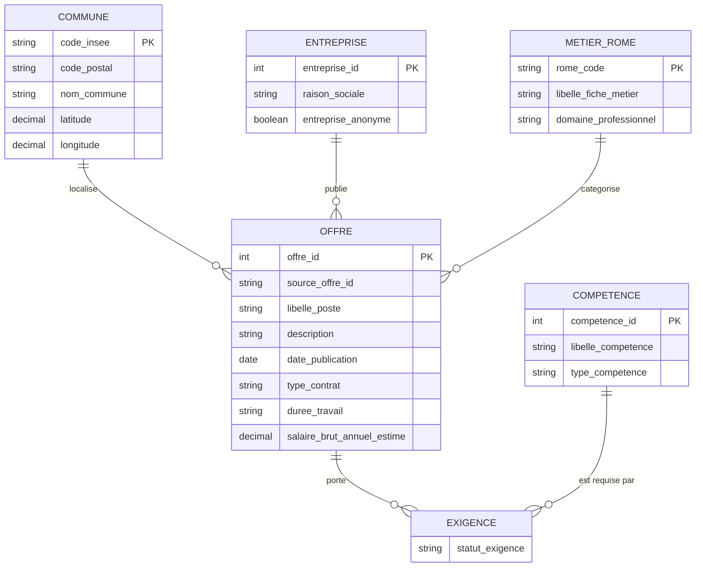
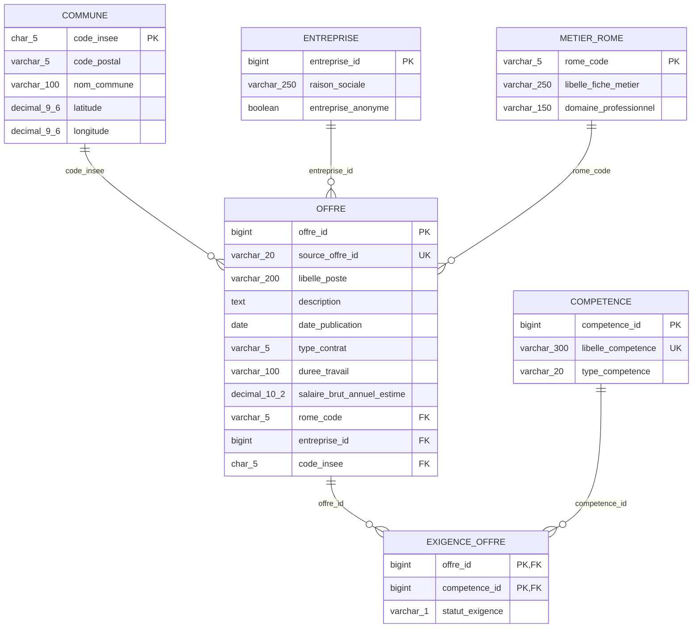

# Plateforme de données sur les offres d'emploi

## Sommaire

* [Démarrage rapide](#démarrage-rapide)
  * [Ce qu'il faut installer](#ce-quil-faut-installer)
  * [1. Télécharger le projet](#1-télécharger-le-projet)
  * [2. Créer le fichier de configuration](#2-créer-le-fichier-de-configuration)
  * [3. Lancer la plateforme](#3-lancer-la-plateforme)
  * [4. Vérifier que tout tourne](#4-vérifier-que-tout-tourne)
  * [5. Ouvrir les tableaux de bord](#5-ouvrir-les-tableaux-de-bord)
  * [6. Arrêter](#6-arrêter)
* [En bref](#en-bref)
* [Architecture du projet](#architecture-du-projet)
* [1. Sujet et problématique métier](#1-sujet-et-problématique-métier)
  * [Domaine](#domaine)
  * [Contexte](#contexte)
  * [Problématique](#problématique)
  * [Objectif](#objectif)
* [2. Sources de données réelles](#2-sources-de-données-réelles)
  * [Points d'audit de la source](#points-daudit-de-la-source)
* [3. Dictionnaire de données](#3-dictionnaire-de-données)
* [4. Identification des entités, cardinalités et justification](#4-identification-des-entités-cardinalités-et-justification)
  * [Entités retenues](#entités-retenues)
  * [Cardinalités et justifications](#cardinalités-et-justifications)
  * [Gestion des cas particuliers](#gestion-des-cas-particuliers)
* [5. Modélisation conceptuelle et logique](#5-modélisation-conceptuelle-et-logique)
  * [Modèle Conceptuel des Données (description textuelle)](#modèle-conceptuel-des-données-description-textuelle)
  * [Modèle Conceptuel des Données (schéma)](#modèle-conceptuel-des-données-schéma)
  * [Modèle Logique des Données (schéma)](#modèle-logique-des-données-schéma)
  * [Modèle Logique des Données (notation relationnelle)](#modèle-logique-des-données-notation-relationnelle)
* [6. Script d'implémentation PostgreSQL](#6-script-dimplémentation-postgresql)
  * [Aperçu des requêtes d'analyse](#aperçu-des-requêtes-danalyse)
* [7. Cartographie globale du pipeline de données](#7-cartographie-globale-du-pipeline-de-données)
  * [Détail des quatre étapes](#détail-des-quatre-étapes)
  * [Cartographie détaillée](#cartographie-détaillée)
* [8. Plateforme data temps quasi réel](#8-plateforme-data-temps-quasi-réel)
  * [En une phrase](#en-une-phrase)
  * [Les mots à connaître](#les-mots-à-connaître)
  * [Les deux sources de données](#les-deux-sources-de-données)
  * [Le trajet d'une offre, étape par étape](#le-trajet-dune-offre-étape-par-étape)
  * [Lancer la plateforme](#lancer-la-plateforme)
  * [Où se trouve quoi dans Docker](#où-se-trouve-quoi-dans-docker)
  * [Les adresses à ouvrir dans le navigateur](#les-adresses-à-ouvrir-dans-le-navigateur)
  * [Configurer Metabase](#configurer-metabase)
  * [Démonstration rapide](#démonstration-rapide)
  * [Commandes utiles](#commandes-utiles)
* [9. Audit qualité et nettoyage](#9-audit-qualité-et-nettoyage)
  * [Livrables qualité](#livrables-qualité)
  * [Résultats principaux](#résultats-principaux)
  * [Exécuter l'audit qualité](#exécuter-laudit-qualité)
* [10. Exploitation, gouvernance et limites](#10-exploitation-gouvernance-et-limites)
* [Annexe — Utilisation sans Docker (développement)](#annexe--utilisation-sans-docker-développement)
  * [Prérequis](#prérequis)
  * [Installer et configurer](#installer-et-configurer)
  * [Initialiser le schéma et les données de test](#initialiser-le-schéma-et-les-données-de-test)
  * [Ingérer des offres depuis l'API France Travail](#ingérer-des-offres-depuis-lapi-france-travail)
  * [Inspecter une offre brute](#inspecter-une-offre-brute)
  * [Lancer les tests](#lancer-les-tests)

## Démarrage rapide

### Ce qu'il faut installer

| Outil | Pourquoi | Lien |
|---|---|---|
| **Git** | Télécharger le projet (facultatif : un ZIP suffit) | <https://git-scm.com/downloads> |
| **Docker Desktop** | Lancer toute la plateforme sans rien installer d'autre (Python, Kafka, Spark, PostgreSQL sont fournis) | <https://www.docker.com/products/docker-desktop/> |
| **Compte francetravail.io** | Récupérer les vraies offres d'emploi (sans lui, tout démarre mais aucune offre réelle n'arrive) | <https://francetravail.io> → créer une application avec l'API « Offres d'emploi v2 » |

Prévoir environ **8 Go de mémoire vive** libre et **5 Go d'espace disque**.
Docker Desktop doit être **démarré** avant de lancer les commandes.

### 1. Télécharger le projet

```bash
git clone https://github.com/ArashiNilou/TP_Cours_Audit_Cartographie_SQL.git
cd TP_Cours_Audit_Cartographie_SQL
```

Sans Git : sur la page GitHub du projet, bouton **Code** → **Download ZIP**,
puis décompresser et ouvrir un terminal dans le dossier obtenu.

### 2. Créer le fichier de configuration

```bash
cp .env.example .env               # macOS / Linux / Git Bash
Copy-Item .env.example .env        # Windows PowerShell
```

Ouvrir `.env` et remplacer les valeurs `remplacer_par_...` :

| Variable | À mettre | Obligatoire ? |
|---|---|---|
| `PGPASSWORD` | Mot de passe de la base, par exemple `postgres` | Oui |
| `FT_CLIENT_ID`, `FT_CLIENT_SECRET` | Identifiants de l'application francetravail.io | Pour avoir des offres réelles |
| `GRAFANA_ADMIN_PASSWORD` | Mot de passe de Grafana | Recommandé |
| `MB_ADMIN_EMAIL`, `MB_ADMIN_PASSWORD` | Compte Metabase créé automatiquement (étape 5) | Facultatif |

Les autres variables (ports, fréquences) ont déjà des valeurs correctes.
Le fichier `.env` n'est jamais envoyé sur Git.

### 3. Lancer la plateforme

```bash
docker compose up -d --build
```

Le premier lancement prend **5 à 10 minutes** (téléchargement et construction
des images). La base PostgreSQL est créée automatiquement avec ses tables et
un petit jeu de données de test.

### 4. Vérifier que tout tourne

```bash
docker compose ps
```

Chaque service doit être `Up` ou `healthy`. Les services `kafka-init` et
`metabase-setup` s'arrêtent normalement après leur travail.

Les premières offres arrivent dans Kafka en quelques minutes ; le nettoyage
Spark tourne toutes les 30 minutes. Pour le lancer tout de suite :

```bash
docker compose run --rm -e SPARK_BATCH_RUN_ONCE=true spark-batch
```

### 5. Ouvrir les tableaux de bord

| Outil | Adresse | Pour quoi faire |
|---|---|---|
| **Plotly Dash** | <http://localhost:8050> | Explorer les offres avec des filtres, une carte et la fiche de chaque offre |
| **Metabase** | <http://localhost:3000> | Tableaux de bord métier (créer le compte au premier accès, ou lancer `docker compose --profile metabase-setup up metabase-setup`) |
| **Grafana** | <http://localhost:3001> | Surveiller la plateforme |
| **Kafka UI** | <http://localhost:8080> | Voir les offres qui passent dans Kafka |

Toutes les adresses et ce qu'il faut y voir sont détaillées
[en section 8](#les-adresses-à-ouvrir-dans-le-navigateur).

### 6. Arrêter

```bash
docker compose down        # arrête tout, les données sont conservées
docker compose down -v     # arrête tout et efface toutes les données
```

En cas de problème (port déjà utilisé, service en erreur, base vide), voir le
[guide d'exploitation](docs/operations/runbook.md).

## En bref

**De quoi parle ce projet ?** On récupère de vraies offres d'emploi publiées
par France Travail pour savoir **quelles compétences numériques sont les plus
recherchées, et où en France**.

Le projet forme une seule plateforme organisée en trois couches complémentaires :

| Partie | Ce qu'on fait | Où le lire |
|---|---|---|
| **Modélisation** | On étudie les données et on dessine la base de données : quelles tables, quelles colonnes, quels liens. | Sections 1 à 7 |
| **Pipeline** | On construit une chaîne automatique qui collecte, nettoie, stocke et affiche les offres. | Section 8 |
| **Qualité** | On mesure la qualité, corrige les anomalies et compare les résultats avant/après. | Section 9 |

**Pour lancer le projet**, suivre le [démarrage rapide](#démarrage-rapide)
ci-dessus : quatre commandes suffisent.

**Toute la documentation** (cartographie, modèles, qualité, exploitation,
RGPD) est répertoriée dans [`docs/README.md`](docs/README.md).

## Architecture du projet

```text
TP_Cours_Audit_Cartographie_SQL/
├── README.md                 # Documentation principale
├── docker-compose.yml        # Orchestration de la plateforme complète
├── apps/
│   └── dataviz/              # Application Plotly Dash
├── infra/
│   ├── docker/               # Images Python et Spark
│   └── monitoring/           # Prometheus et provisioning Grafana
├── database/
│   ├── schema/               # Schéma métier, données de test et objets du pipeline
│   ├── analytics/            # Requêtes d'analyse métier
│   └── quality/              # Audit, nettoyage et contrôles après traitement
├── requirements.txt          # Dépendances Python uniques (tous les services et tests)
├── .env.example              # Modèle des variables de connexion (sans secret)
├── docs/
│   ├── README.md             # Index de toute la documentation
│   ├── architecture/         # Architecture (README.md) et schémas Mermaid du pipeline et de la qualité
│   ├── cartography/          # Cartographie source → cible champ par champ
│   ├── data-model/           # MCD, MLD, DBML et schéma illustré
│   ├── quality/              # Document d'audit qualité unique (README.md) et exports CSV
│   ├── operations/           # Guide d'exploitation (incidents, sauvegarde, purge)
│   ├── governance/           # Licences des sources, RGPD et secrets
│   ├── presentation/         # Présentation du projet
│   ├── known-limitations.md  # Limites connues et pistes d'amélioration
│   └── data-dictionary.md    # Dictionnaire de données unifié
├── src/
│   └── emploi_pipeline/      # Code applicatif unifié : API, Kafka, Data Lake, Spark et PostgreSQL
├── scripts/
│   ├── inspect_offre.py      # Inspection ponctuelle d'une offre
│   └── run_pipeline_batch.py # Point d'entrée spark-submit
├── tests/                    # Tests automatisés de toute la plateforme
└── main.py                   # Point d'entrée : connexion / --init / --sync-api

```

Chaque couche a une responsabilité unique :
- `docs/` regroupe toute la documentation fonctionnelle et technique ;
- `database/` contient tous les scripts PostgreSQL classés par usage ;
- `src/emploi_pipeline/` contient tout le code applicatif ;
- `apps/` contient les interfaces utilisateur ;
- `infra/` contient uniquement la configuration Docker et la supervision ;
- `scripts/` regroupe les points d'entrée et utilitaires ponctuels ;
- `main.py` reste un point d'entrée fin, sans logique métier.

Les noms SQL historiques commençant par `tp2_` ou `tp3_` sont conservés pour
rester compatibles avec la base et les volumes Docker existants. Ils ne
correspondent plus à l'organisation des dossiers.

## 1. Sujet et problématique métier

### Domaine

Emploi, marché du travail et recrutement.

### Contexte

Les acteurs publics et privés du marché du travail (opérateurs de l'emploi,
collectivités territoriales, cabinets de recrutement) cherchent à comprendre,
en temps quasi réel, quelles compétences numériques sont les plus recherchées
et sur quels territoires. Les offres d'emploi diffusées par les plateformes
nationales constituent une matière première précieuse, mais elles arrivent
sous forme de flux JSON semi-structurés, imbriqués et hétérogènes, tandis que
les référentiels nationaux de métiers et de géographie sont publiés dans des
formats et des granularités différents.

### Problématique

Comment transformer des flux d'offres d'emploi semi-structurés issus d'une
API et des référentiels nationaux hétérogènes en un entrepôt relationnel en
troisième forme normale, fiable et interrogeable, permettant d'identifier en
temps réel les compétences les plus recherchées par type de contrat et par
bassin d'emploi ?

### Objectif

* Concevoir un dictionnaire de données couvrant l'ensemble des champs
  mobilisés pour la modélisation.
* Formaliser le Modèle Conceptuel des Données et le Modèle Logique des
  Données correspondants.
* Générer le code DBML complet, prêt à être importé dans dbdiagram.io.
* Livrer un script DDL PostgreSQL complet, avec contraintes, index, données
  de test et requêtes d'analyse orientées tableau de bord RH.

## 2. Sources de données réelles

| Nom | Organisation | URL | Format | Nature | Description métier |
|---|---|---|---|---|---|
| API « Offres d'emploi v2 » | France Travail | <https://francetravail.io/produits-partages/catalogue/offres-emploi> | JSON | Semi-structurée, objets imbriqués | Flux d'offres d'emploi avec objets imbriqués `lieuTravail` (commune, code postal, coordonnées GPS), `entreprise`, code et libellé ROME, tableau `competences[]` et bloc `salaire` en texte libre. Alimente l'ensemble du schéma 3NF. |
| API Géo — communes | État (DINUM), données INSEE et La Poste | <https://geo.api.gouv.fr/communes?fields=nom,code,codesPostaux,centre&format=json> | JSON | Structurée | Référentiel officiel des communes françaises : code INSEE, nom officiel, codes postaux et centre géographique. Sert à vérifier et corriger le lieu de travail de chaque offre. |

Le cahier des charges initial envisageait aussi le référentiel ROME 4.0 en
CSV. Ce croisement s'est avéré inutile : l'API France Travail renvoie déjà,
pour chaque offre, un code et un libellé ROME (`romeCode`, `romeLibelle`). La
table `metier_rome` est donc alimentée par extraction et dédoublonnage depuis
le flux des offres. En revanche, le lieu de travail fourni par France Travail
est parfois incomplet ou non officiel : il est rapproché par code INSEE du
référentiel de l'API Géo (98,5 % des offres retrouvées), qui remplace alors le
nom, le code postal et les coordonnées de la commune. Le détail champ par champ
est dans la [cartographie source → cible](docs/cartography/source-to-target-mapping.md).

### Points d'audit de la source

* Les objets `entreprise`, `salaire` et `lieuTravail` sont parfois absents
  ou partiellement renseignés.
* Le champ salaire est un texte libre nécessitant un parsing par expression
  régulière pour en extraire une valeur numérique exploitable
  (`parse_salaire_annuel` dans `src/emploi_pipeline/ingest.py`).
* Le tableau `competences[]` peut être vide, contenir des doublons, ou
  mélanger savoir-faire et savoir-être sans distinction explicite.
* Le code postal fourni par `lieuTravail` n'est pas toujours un identifiant
  stable de commune (plusieurs codes postaux par commune ou inversement) :
  seul le code INSEE est retenu comme clé de rattachement géographique
  fiable dans le modèle (`commune.code_insee`).
* Le libellé de domaine professionnel n'étant pas fourni tel quel par
  l'API, il est déduit de la première lettre du code ROME selon la
  nomenclature officielle des 14 grands domaines (`resolve_domaine_professionnel`).

## 3. Dictionnaire de données

Une version autonome de ce dictionnaire, incluant les champs d'audit et
d'enrichissement du pipeline, est disponible dans
[`docs/data-dictionary.md`](docs/data-dictionary.md).

| Champ | Description fonctionnelle | Type SQL cible | Exemple de valeur | Contraintes & règle métier |
|---|---|---|---|---|
| `offre_id` | Identifiant technique interne de l'offre | `bigint` | `1` | PK générée automatiquement |
| `source_offre_id` | Identifiant de l'offre côté API France Travail | `varchar(20)` | `178XYZW` | NOT NULL, UNIQUE ; garantit la traçabilité avec la source |
| `libelle_poste` | Intitulé du poste proposé | `varchar(200)` | `Data Engineer / DBA PostgreSQL (F/H)` | NOT NULL |
| `description` | Description synthétique de l'offre | `text` | `Au sein du pôle Data, vous concevez...` | Nullable, texte libre |
| `date_publication` | Date de publication de l'offre | `date` | `2026-09-18` | NOT NULL |
| `type_contrat` | Type de contrat proposé | `varchar(5)` | `CDI` | NOT NULL, CHECK IN ('CDI', 'CDD', 'MIS', 'SAI', 'CCE') |
| `duree_travail` | Régime horaire déclaré | `varchar(100)` | `35H Horaires normaux` | Nullable |
| `salaire_brut_annuel_estime` | Salaire brut annuel estimé, extrait du texte libre par parsing | `numeric(10,2)` | `41500.00` | Nullable, CHECK >= 0 |
| `entreprise_id` | Référence à l'entreprise recruteuse | `bigint` | `1` | FK vers `entreprise`, NOT NULL |
| `raison_sociale` | Nom de l'entreprise recruteuse | `varchar(250)` | `TECH INNOVATION` | Nullable si `entreprise_anonyme = true` ; NOT NULL sinon (règle métier appliquée par `CHECK`) |
| `entreprise_anonyme` | Indique si l'entreprise a choisi de rester anonyme dans l'offre | `boolean` | `false` | NOT NULL, défaut `false` |
| `rome_code` | Code du métier ROME associé à l'offre | `varchar(5)` | `M1805` | FK vers `metier_rome`, NOT NULL |
| `libelle_fiche_metier` | Libellé de la fiche métier ROME | `varchar(250)` | `Études et développement informatique` | NOT NULL |
| `domaine_professionnel` | Domaine professionnel de rattachement du métier | `varchar(150)` | `Systèmes d'information et télécommunications` | NOT NULL |
| `libelle_competence` | Libellé de la compétence technique ou comportementale | `varchar(300)` | `Langage SQL` | NOT NULL, UNIQUE |
| `type_competence` | Nature de la compétence | `varchar(20)` | `Savoir-faire` | NOT NULL, CHECK IN ('Savoir-faire', 'Savoir-être') |
| `statut_exigence` | Caractère exigé ou souhaité d'une compétence pour une offre donnée | `varchar(1)` | `E` | NOT NULL, CHECK IN ('E', 'S') |
| `code_insee` | Code officiel INSEE de la commune | `char(5)` | `44172` | PK de `commune`, FK dans `offre`, NOT NULL |
| `code_postal` | Code postal associé à la commune | `varchar(5)` | `44980` | NOT NULL |
| `nom_commune` | Libellé officiel de la commune | `varchar(100)` | `Sainte-Luce-sur-Loire` | NOT NULL |
| `latitude` | Latitude du centroïde de la commune | `numeric(9,6)` | `47.249400` | Nullable, CHECK entre -90 et 90 |
| `longitude` | Longitude du centroïde de la commune | `numeric(9,6)` | `-1.486200` | Nullable, CHECK entre -180 et 180 |

## 4. Identification des entités, cardinalités et justification

### Entités retenues

* **COMMUNE** : bassin d'emploi identifié par le code INSEE.
* **ENTREPRISE** : entité recruteuse, pouvant être anonyme dans l'offre
  publiée.
* **METIER_ROME** : référentiel des métiers, garantissant un classement
  stable des offres.
* **COMPETENCE** : référentiel des compétences techniques et
  comportementales, dédoublonné.
* **OFFRE** : table de faits centrale portant les caractéristiques propres à
  chaque offre d'emploi.
* **EXIGENCE_OFFRE** : table d'association entre `OFFRE` et `COMPETENCE`,
  porteuse de l'attribut `statut_exigence`.

### Cardinalités et justifications

| Relation | Cardinalité | Justification métier |
|---|---|---|
| `COMMUNE` localise `OFFRE` | OFFRE `1,1` — COMMUNE `0,N` | Chaque offre est publiée pour un unique bassin d'emploi identifié par son code INSEE (`code_insee` est NOT NULL dans `OFFRE`) ; une commune peut ne recevoir aucune offre sur la période observée ou en recevoir plusieurs. Le code INSEE, plutôt que le code postal ou le libellé, est retenu comme clé car il est stable et sans ambiguïté, contrairement au code postal qui peut être partagé par plusieurs communes ou inversement. |
| `ENTREPRISE` publie `OFFRE` | OFFRE `1,1` — ENTREPRISE `0,N` | Chaque offre est rattachée à une entreprise recruteuse, même lorsque celle-ci choisit de rester anonyme : dans ce cas, `entreprise_id` reste renseigné mais `raison_sociale` est laissé à `NULL` et `entreprise_anonyme` passe à `true`. Une entreprise peut publier plusieurs offres ou n'en publier aucune sur le périmètre observé. Cette modélisation évite de perdre l'information de regroupement des offres d'une même entreprise anonyme tout en respectant la confidentialité demandée. |
| `METIER_ROME` catégorise `OFFRE` | OFFRE `1,1` — METIER_ROME `0,N` | Chaque offre est rattachée à un unique code ROME, permettant de comparer objectivement des offres provenant d'entreprises différentes sur un même métier ; un métier du référentiel peut ne correspondre à aucune offre observée. |
| `OFFRE` requiert `COMPETENCE` | OFFRE `0,N` — COMPETENCE `0,N`, via `EXIGENCE_OFFRE` | La relation entre une offre et les compétences attendues est intrinsèquement plusieurs-à-plusieurs : une offre mentionne généralement plusieurs compétences, et une compétence donnée (par exemple « Langage SQL ») est demandée par de nombreuses offres différentes. Une relation binaire directe entre `OFFRE` et `COMPETENCE` ne permettrait pas de conserver l'information de statut (« Exigé » ou « Souhaité ») associée à chaque paire offre/compétence ; la table de liaison `EXIGENCE_OFFRE` est donc indispensable pour porter cet attribut sans redondance et sans violer la troisième forme normale. La cardinalité minimale est `0` côté OFFRE : environ 12 % des offres publiées par France Travail ne listent aucune compétence. Elles sont conservées (les rejeter ferait perdre des offres réelles) et leur proportion est mesurée par l'audit qualité. |

### Gestion des cas particuliers

* **Entreprises anonymes** : l'anonymat est un attribut de l'entreprise et
  non de l'offre, car une même entreprise anonyme peut publier plusieurs
  offres sous la même identité masquée. La contrainte `CHECK` garantit qu'une
  entreprise non anonyme possède obligatoirement une raison sociale, et
  qu'une entreprise anonyme peut légitimement avoir une raison sociale
  absente.
* **Communes sans coordonnées GPS** : le bloc `lieuTravail` de l'API ne
  fournit pas systématiquement de coordonnées précises pour chaque commune ;
  `latitude` et `longitude` restent donc nullables, sans remettre en cause
  l'usage du code INSEE comme identifiant géographique principal.

## 5. Modélisation conceptuelle et logique

### Modèle Conceptuel des Données (description textuelle)

Une `COMMUNE`, identifiée par son code INSEE, peut localiser plusieurs
`OFFRE`. Une `ENTREPRISE`, anonyme ou non, peut publier plusieurs `OFFRE`.
Chaque `OFFRE` est rattachée à un unique `METIER_ROME` du référentiel. Chaque
`OFFRE` peut requérir plusieurs `COMPETENCE`, et chaque `COMPETENCE` peut être
requise par plusieurs `OFFRE` ; cette relation plusieurs-à-plusieurs est
portée par l'association `EXIGENCE_OFFRE`, qui qualifie chaque lien par un
statut d'exigence (« Exigé » ou « Souhaité »). Les attributs propres à
l'offre (libellé, description, date de publication, type de contrat, durée
de travail, salaire estimé) ne sont stockés qu'une seule fois, dans
`OFFRE`, car ils dépendent uniquement de l'identifiant de l'offre.

### Modèle Conceptuel des Données (schéma)

Représentation Merise : chaque entité porte son **identifiant** (marqué `PK`,
équivalent de l'attribut souligné en Merise) et ses seuls attributs
fonctionnels, sans clé étrangère ni type SQL précis. Les relations sont
nommées par un verbe métier et qualifiées par leurs cardinalités. L'association
`EXIGENCE`, porteuse de l'attribut `statut_exigence`, n'a pas d'identifiant
propre : elle est identifiée par le couple (offre, compétence) des entités
qu'elle relie.

Choix des identifiants :

| Entité | Identifiant | Justification |
|---|---|---|
| COMMUNE | `code_insee` | Code officiel, stable et unique (le code postal ne l'est pas) |
| METIER_ROME | `rome_code` | Code officiel de la nomenclature ROME |
| ENTREPRISE | `entreprise_id` | Aucun identifiant naturel fiable : le nom peut être absent (entreprise anonyme) |
| OFFRE | `offre_id` | Identifiant interne, indépendant de la source ; l'identifiant France Travail `source_offre_id` reste unique (identifiant alternatif) |
| COMPETENCE | `competence_id` | Identifiant interne ; le libellé reste unique (identifiant alternatif) mais peut être corrigé |


```mermaid
erDiagram
    COMMUNE ||--o{ OFFRE : "localise"
    ENTREPRISE ||--o{ OFFRE : "publie"
    METIER_ROME ||--o{ OFFRE : "categorise"
    OFFRE ||--o{ EXIGENCE : "porte"
    COMPETENCE ||--o{ EXIGENCE : "est requise par"

    COMMUNE {
        string code_insee PK
        string code_postal
        string nom_commune
        decimal latitude
        decimal longitude
    }
    ENTREPRISE {
        int entreprise_id PK
        string raison_sociale
        boolean entreprise_anonyme
    }
    METIER_ROME {
        string rome_code PK
        string libelle_fiche_metier
        string domaine_professionnel
    }
    OFFRE {
        int offre_id PK
        string source_offre_id
        string libelle_poste
        string description
        date date_publication
        string type_contrat
        string duree_travail
        decimal salaire_brut_annuel_estime
    }
    COMPETENCE {
        int competence_id PK
        string libelle_competence
        string type_competence
    }
    EXIGENCE {
        string statut_exigence
    }
```

*Note de lecture Merise : une cardinalité se lit du côté de l'entité qu'elle
décrit. `OFFRE (1,1)` signifie qu'une offre est liée à exactement une commune,
une entreprise et un métier ; `COMMUNE (0,N)`, `ENTREPRISE (0,N)` et
`METIER_ROME (0,N)` signifient que chacune peut être liée à zéro ou plusieurs
offres. La notation Mermaid `||--o{` (pattes d'oie) place le symbole de
l'autre côté : `COMMUNE ||--o{ OFFRE` se lit « une offre a exactement une
commune, une commune a zéro ou plusieurs offres ».*

Ce diagramme est également disponible en fichier autonome dans
[`docs/data-model/mcd.mmd`](docs/data-model/mcd.mmd), à coller directement sur
<https://mermaid.live> ou à ouvrir dans un éditeur supportant Mermaid.

### Modèle Logique des Données (schéma)

Représentation avec clés primaires, clés étrangères et types SQL cibles,
conformément au script `database/schema/01_schema.sql`. Contrairement au MCD, la
relation plusieurs-à-plusieurs est ici matérialisée par la table physique
`EXIGENCE_OFFRE`, porteuse de sa propre clé primaire composée.


```mermaid
erDiagram
    COMMUNE ||--o{ OFFRE : "code_insee"
    ENTREPRISE ||--o{ OFFRE : "entreprise_id"
    METIER_ROME ||--o{ OFFRE : "rome_code"
    OFFRE ||--o{ EXIGENCE_OFFRE : "offre_id"
    COMPETENCE ||--o{ EXIGENCE_OFFRE : "competence_id"

    COMMUNE {
        char_5 code_insee PK
        varchar_5 code_postal
        varchar_100 nom_commune
        decimal_9_6 latitude
        decimal_9_6 longitude
    }
    ENTREPRISE {
        bigint entreprise_id PK
        varchar_250 raison_sociale
        boolean entreprise_anonyme
    }
    METIER_ROME {
        varchar_5 rome_code PK
        varchar_250 libelle_fiche_metier
        varchar_150 domaine_professionnel
    }
    OFFRE {
        bigint offre_id PK
        varchar_20 source_offre_id UK
        varchar_200 libelle_poste
        text description
        date date_publication
        varchar_5 type_contrat
        varchar_100 duree_travail
        decimal_10_2 salaire_brut_annuel_estime
        varchar_5 rome_code FK
        bigint entreprise_id FK
        char_5 code_insee FK
    }
    COMPETENCE {
        bigint competence_id PK
        varchar_300 libelle_competence UK
        varchar_20 type_competence
    }
    EXIGENCE_OFFRE {
        bigint offre_id PK, FK
        bigint competence_id PK, FK
        varchar_1 statut_exigence
    }
```

Ce diagramme est également disponible en fichier autonome dans
[`docs/data-model/mld.mmd`](docs/data-model/mld.mmd), à coller directement sur
<https://mermaid.live> ou à ouvrir dans un éditeur supportant Mermaid.

### Modèle Logique des Données (notation relationnelle)

Convention Merise : la clé primaire est **soulignée** (ici en gras), les clés
étrangères sont préfixées par `#` et suivies de la table référencée.

* COMMUNE (**code_insee**, code_postal, nom_commune, latitude, longitude)
* ENTREPRISE (**entreprise_id**, raison_sociale, entreprise_anonyme)
* METIER_ROME (**rome_code**, libelle_fiche_metier, domaine_professionnel)
* COMPETENCE (**competence_id**, libelle_competence, type_competence)
* OFFRE (**offre_id**, source_offre_id, libelle_poste, description,
  date_publication, type_contrat, duree_travail, salaire_brut_annuel_estime,
  #rome_code → METIER_ROME, #entreprise_id → ENTREPRISE,
  #code_insee → COMMUNE)
* EXIGENCE_OFFRE (**#offre_id → OFFRE, #competence_id → COMPETENCE**,
  statut_exigence)

Règles de passage du MCD au MLD appliquées :

| Association du MCD | Cardinalités | Traduction dans le MLD |
|---|---|---|
| COMMUNE — localise — OFFRE | 0,N / 1,1 | La clé de COMMUNE migre dans OFFRE (`#code_insee`, NOT NULL) |
| ENTREPRISE — publie — OFFRE | 0,N / 1,1 | La clé d'ENTREPRISE migre dans OFFRE (`#entreprise_id`, NOT NULL) |
| METIER_ROME — catégorise — OFFRE | 0,N / 1,1 | La clé de METIER_ROME migre dans OFFRE (`#rome_code`, NOT NULL) |
| OFFRE — requiert — COMPETENCE | 0,N / 0,N | L'association devient la table EXIGENCE_OFFRE, clé composée des deux clés étrangères, porteuse de `statut_exigence` |

Les clés alternatives (`UNIQUE`) sont `OFFRE.source_offre_id` (identifiant
France Travail) et `COMPETENCE.libelle_competence`.

Le MLD ne contient que les tables issues du MCD. Les tables techniques du
pipeline et de la qualité (`tp2_*`, `tp3_*`) n'appartiennent pas au modèle
métier : elles figurent uniquement dans le modèle physique
[`docs/data-model/model.dbml`](docs/data-model/model.dbml) et dans le
[dictionnaire de données](docs/data-dictionary.md).

Convention de lecture du schéma : les clés primaires sont indiquées par `PK`,
les clés étrangères par `FK` et les clés alternatives par `UK`. Le modèle
respecte la troisième forme normale : chaque attribut
non-clé dépend de la totalité de la clé primaire de sa table et d'aucun
autre attribut, les référentiels (`METIER_ROME`, `COMPETENCE`, `COMMUNE`,
`ENTREPRISE`) sont séparés de la table de faits `OFFRE`, et la relation
plusieurs-à-plusieurs est résolue par `EXIGENCE_OFFRE`.

## 6. Script d'implémentation PostgreSQL

Les scripts sont classés par responsabilité dans le dossier
[`database/`](database) :

| Fichier | Rôle |
|---|---|
| [`database/schema/01_schema.sql`](database/schema/01_schema.sql) | `DROP TABLE IF EXISTS ... CASCADE` dans l'ordre inverse des dépendances, puis création des six tables avec types stricts (`BIGINT` en identité, `VARCHAR`, `NUMERIC`, `DATE`, `BOOLEAN`, `CHAR`), clés primaires, clés étrangères avec `ON DELETE RESTRICT/CASCADE` et `ON UPDATE CASCADE`, contraintes `CHECK` de validation (format du code INSEE, type de contrat autorisé, salaire positif, cohérence de l'anonymat des entreprises), et huit index B-Tree ciblant les colonnes de jointure et de filtrage les plus fréquentes. |
| [`database/schema/02_seed.sql`](database/schema/02_seed.sql) | Jeu de données de test cohérent : deux communes, deux entreprises (dont une anonyme), deux fiches ROME, quatre compétences, trois offres et leurs liaisons de compétences avec statut d'exigence. |
| [`database/schema/03_pipeline_schema.sql`](database/schema/03_pipeline_schema.sql) | Tables techniques du pipeline (`tp2_pipeline_run`, `tp2_offre_enrichment`) et vues de suivi, créées au premier démarrage Docker. |
| [`database/analytics/business_queries.sql`](database/analytics/business_queries.sql) | Deux requêtes SQL avancées orientées tableau de bord RH. |

### Aperçu des requêtes d'analyse

```sql
-- Requête 1 : compétences attendues par offre, avec métier ROME,
-- type de contrat et bassin d'emploi (STRING_AGG).
SELECT
    o.source_offre_id,
    o.libelle_poste,
    mr.libelle_fiche_metier,
    o.type_contrat,
    nc.nom_commune,
    STRING_AGG(
        c.libelle_competence || ' (' || eo.statut_exigence || ')',
        ', ' ORDER BY eo.statut_exigence, c.libelle_competence
    ) AS competences_attendues
FROM offre o
JOIN metier_rome mr    ON mr.rome_code = o.rome_code
JOIN commune nc        ON nc.code_insee = o.code_insee
JOIN exigence_offre eo ON eo.offre_id = o.offre_id
JOIN competence c      ON c.competence_id = eo.competence_id
GROUP BY o.offre_id, o.source_offre_id, o.libelle_poste,
         mr.libelle_fiche_metier, o.type_contrat, nc.nom_commune
ORDER BY o.date_publication DESC;
```

```sql
-- Requête 2 : tension du marché par bassin d'emploi et type de contrat,
-- avec salaire moyen estimé (AVG) et compétences exigées associées.
SELECT
    c.nom_commune,
    o.type_contrat,
    COUNT(DISTINCT o.offre_id)                       AS nombre_offres,
    ROUND(AVG(o.salaire_brut_annuel_estime), 2)      AS salaire_moyen_estime,
    STRING_AGG(DISTINCT comp.libelle_competence, ', ' ORDER BY comp.libelle_competence)
                                                       AS competences_demandees
FROM offre o
JOIN commune c              ON c.code_insee = o.code_insee
JOIN exigence_offre eo       ON eo.offre_id = o.offre_id
JOIN competence comp         ON comp.competence_id = eo.competence_id
WHERE eo.statut_exigence = 'E'
GROUP BY c.nom_commune, o.type_contrat
ORDER BY nombre_offres DESC, salaire_moyen_estime DESC;
```

## 7. Cartographie globale du pipeline de données

```text
 API France Travail (JSON, toutes les 15 min)     API Géo communes (JSON, 1 fois / jour)
                 |                                              |
                 v                                              |
      Kafka  topic france-travail.offres.raw                    |
                 |                                              |
                 v                                              v
   Data Lake  raw/  (JSON bruts, jamais modifiés)  <------------+
                 |
                 v   rapprochement par code INSEE
   Data Lake  aggregated/  (offre + commune officielle, JSONL)
                 |
                 v   PySpark : champs obligatoires, doublons, types, salaire
   Data Lake  curated/  (Parquet)        offres invalides --> quarantine/
                 |
                 v   normalisation 3NF, chargement transactionnel
   PostgreSQL  commune, entreprise, metier_rome, competence, offre, exigence_offre
                 |
                 +--> Audit qualité (17 contrôles, nettoyage journalisé)
                 |
       +---------+-----------+------------------+
       v                     v                  v
   Metabase             Plotly Dash       Prometheus + Grafana
   (BI métier)        (dataviz interactive)  (supervision)
```

### Détail des quatre étapes

1. **Extraction** : interroger périodiquement l'API « Offres d'emploi v2 »
   de France Travail (authentification OAuth2). Chaque offre embarque déjà,
   sous forme imbriquée, son code et libellé ROME ainsi que sa commune de
   rattachement. Le référentiel officiel des communes (API Géo) est collecté
   une fois par jour pour vérifier et compléter le lieu de travail.
   Les réponses JSON brutes sont conservées telles quelles, avec horodatage
   de collecte, avant toute transformation (voir `scripts/inspect_offre.py`
   pour l'inspection manuelle d'une offre brute).

2. **Audit et nettoyage (data wrangling)** : profiler la présence ou
   l'absence des objets imbriqués (`entreprise`, `lieuTravail`, `salaire`) ;
   aplatir le tableau `competences[]` en une ligne par compétence et par
   offre ; extraire une valeur numérique de salaire à partir du texte libre
   par expression régulière (par exemple `Annuel de 38000.0 Euros à 45000.0
   Euros` devient une valeur médiane estimée) ; dédupliquer les libellés de
   compétences afin d'éviter la création de doublons dans le référentiel ;
   traiter explicitement le cas des entreprises anonymes en distinguant
   absence de nom et confidentialité volontaire ; rejeter et journaliser
   toute offre dont le code ROME, la commune, la date de publication ou le
   type de contrat sont manquants ou non conformes aux contraintes du
   schéma : ces offres sont écartées dans la zone `quarantine/` du Data Lake
   avec la raison du rejet.

3. **Normalisation et structuration** : construire les tables de
   référentiel (`commune`, `entreprise`, `metier_rome`, `competence`)
   dédupliquées, puis alimenter la table de faits `offre` en ne conservant
   qu'une ligne par identifiant source d'offre, et enfin peupler la table
   d'association `exigence_offre` afin de représenter la relation
   plusieurs-à-plusieurs entre offres et compétences, sans redondance et en
   respectant la troisième forme normale.

4. **Stockage et exploitation** : charger l'ensemble en transaction dans
   PostgreSQL, vérifier la satisfaction de toutes les contraintes
   d'intégrité et l'efficacité des index de jointure, puis exposer les
   données à des outils de restitution tels que Metabase ou tout autre
   outil de Business Intelligence pour construire des tableaux de bord de
   pilotage RH : compétences les plus demandées par métier et par bassin
   d'emploi, salaire moyen estimé par type de contrat, et suivi dans le
   temps des tensions de recrutement territoriales.

### Cartographie détaillée

| Document | Contenu |
|---|---|
| [Cartographie source → cible](docs/cartography/source-to-target-mapping.md) | Pour chaque colonne PostgreSQL : champ JSON d'origine, transformation, règle de rejet |
| [Schéma du pipeline](docs/architecture/pipeline.mmd) | Composants, formats et fréquences de bout en bout |
| [Data Lake](docs/architecture/README.md#1-data-lake) | Zones, partitions, volumétrie et rétention |
| [Contrats d'événements](docs/architecture/README.md#2-contrats-dévénements) | Format des messages Kafka et des enregistrements agrégés |
| [Modèle physique complet](docs/data-model/model.dbml) | 11 tables (6 métier + 5 techniques), à coller dans dbdiagram.io |

## 8. Plateforme data temps quasi réel

### En une phrase

La plateforme récupère automatiquement des offres d'emploi, les nettoie, les range
dans PostgreSQL et les affiche dans des tableaux de bord. Tout se lance avec
**une seule commande** Docker.

### Les mots à connaître

| Mot | Explication simple |
|---|---|
| **API** | Un site qui renvoie des données au lieu de pages web. Ici : les offres d'emploi de France Travail. |
| **Docker** | Un outil qui lance chaque programme dans une « boîte » (un conteneur) déjà configurée. Pas besoin d'installer Kafka, Spark, etc. |
| **Image Docker** | Le « modèle » d'un programme, prêt à l'emploi (comme un fichier d'installation). Elle ne contient pas vos données. |
| **Conteneur Docker** | Un programme **en marche**, lancé à partir d'une image. |
| **Volume Docker** | Un espace de stockage géré par Docker, où les conteneurs gardent leurs **données**. Il survit à l'arrêt des conteneurs. |
| **Montage local (bind mount)** | Un fichier ou dossier **du projet** rendu visible dans un conteneur (configurations, scripts SQL). |
| **Kafka** | Une « boîte aux lettres » : le producteur y dépose les offres, un autre programme vient les chercher. |
| **Data Lake** | Un dossier où l'on garde **toutes** les données brutes, sans rien effacer, pour pouvoir tout rejouer. |
| **PySpark** | L'outil qui nettoie les données (champs vides, doublons, types). |
| **PostgreSQL** | La base de données finale, propre et organisée en tables. |
| **Metabase** | L'outil de graphiques pour lire les données métier (offres, compétences, villes). |
| **Plotly Dash** | Une page web en Python avec des graphiques **interactifs** (filtres, zoom, survol, carte). |
| **Prometheus** | Il relève régulièrement des chiffres techniques sur chaque service (est-il en marche ? combien de messages ?). |
| **Grafana** | Il affiche ces chiffres techniques en graphiques pour surveiller la plateforme. |

### Les deux sources de données

| Source | Ce qu'elle apporte | Comment on la récupère | Où elle arrive |
|---|---|---|---|
| **API France Travail** « Offres d'emploi v2 » | Les offres d'emploi : métier, contrat, salaire, compétences, commune. | Le programme `ft-producer` l'interroge toutes les 15 minutes (compte France Travail nécessaire). | Kafka, dans le topic `france-travail.offres.raw`. |
| **API Géo** du gouvernement (`geo.api.gouv.fr/communes`) | La liste officielle des communes : nom, codes postaux, coordonnées GPS. | Le programme `communes-collector` la télécharge une fois par jour (sans compte). | Data Lake, dossier `raw/communes/`. |

**Pourquoi les deux ?** Chaque offre contient un code de commune (code INSEE).
On s'en sert pour relier l'offre à la fiche officielle de la commune, et ainsi
corriger ou compléter le nom de la ville et sa position GPS.

Le producteur France Travail parcourt les **101 départements**, sans filtre de
métier. Il utilise la pagination de l'API et récupère jusqu'à **200 offres
récentes par département et par cycle**. Cette limite protège le poste local
et les quotas de l'API ; elle se règle avec
`FT_PRODUCER_MAX_PER_DEPARTEMENT` (`0` signifie : aller jusqu'au plafond de
l'API, soit 1 149 résultats par département). Les offres inchangées ne sont
pas republiées pendant la durée de vie du producteur.

### Le trajet d'une offre, étape par étape

```text
1. COLLECTER    ft-producer récupère les offres sur l'API France Travail
       ↓
2. TRANSPORTER  les offres sont déposées dans Kafka
       ↓
3. STOCKER      raw-aggregator les copie telles quelles dans le Data Lake (raw/)
                puis les relie aux communes officielles (aggregated/)
       ↓
4. TRANSFORMER  spark-batch (PySpark) nettoie : champs obligatoires, doublons, types
                les offres invalides sont mises de côté dans quarantine/
       ↓
5. CHARGER      les offres propres sont enregistrées dans PostgreSQL (schéma 3NF)
       ↓
6. VISUALISER   Metabase et Plotly Dash affichent les offres, compétences et villes
       ↓
7. SUPERVISER   Prometheus + Grafana vérifient que tout fonctionne
                et comparent le nombre d'offres brutes et propres
```

Le schéma complet est dans
[`docs/architecture/pipeline.mmd`](docs/architecture/pipeline.mmd).

Organisation du Data Lake. Ce n'est **pas** un dossier du projet : c'est le
**volume Docker** `tp_cours_audit_cartographie_sql_data_lake`, visible dans
les conteneurs sous le chemin `/data-lake` :

```text
data-lake/
├── raw/
│   ├── france_travail/   # offres brutes, exactement comme reçues
│   └── communes/         # référentiel officiel des communes
├── aggregated/offres/    # offres + infos de la commune officielle
├── curated/offres/       # offres nettoyées par PySpark (format Parquet)
└── quarantine/spark/     # offres rejetées, avec la raison du rejet
```

Le Data Lake ne contient **pas de code**, seulement des **fichiers de
données**, dans trois formats :

| Dossier | Format | Contenu | Écrit par | Exemple de fichier |
|---|---|---|---|---|
| `raw/france_travail/` | **JSON**, un fichier par offre | L'offre brute, exactement comme reçue de Kafka | `raw_aggregator_emploi` (Python) | `ingestion_date=2026-09-25/bbdcb3ae-….json` |
| `raw/communes/` | **JSON**, un fichier par collecte | La liste des communes de l'API Géo | `communes_collector_emploi` (Python) | `ingestion_date=2026-09-25/communes_20260925T085832_594092Z.json` et `_latest.json` (copie de la dernière collecte) |
| `aggregated/offres/` | **JSONL**, une offre par ligne | L'offre et la fiche de sa commune officielle | `raw_aggregator_emploi` (Python) | `ingestion_date=2026-09-25/part-50e0a1ec-….jsonl` |
| `curated/offres/` | **Parquet** compressé Snappy | Les offres nettoyées, en colonnes typées | `spark_batch_emploi` (PySpark) | `run_id=…/part-00000-….snappy.parquet` |
| `quarantine/spark/` | **JSON Lines**, une offre rejetée par ligne | Les offres rejetées et la raison du rejet | `spark_batch_emploi` (PySpark) | `run_id=…/part-00000-….json` |

Comment lire ces fichiers :

* **JSON / JSONL** : du texte lisible dans n'importe quel éditeur, par exemple
  `{"event_id": "...", "payload": {...}}`. En JSONL, chaque ligne est un objet
  JSON complet.
* **Parquet** : un format binaire rangé par colonnes, très rapide pour Spark.
  Il ne se lit pas dans un éditeur de texte : il faut passer par Spark, pandas
  ou DuckDB.
* **Fichiers `_SUCCESS` et `.crc`** : Spark les crée automatiquement.
  `_SUCCESS` signale que l'écriture est terminée, et les `.crc` servent à
  vérifier que les fichiers ne sont pas corrompus.
* **Dossiers `ingestion_date=…` et `run_id=…`** : ils classent les fichiers
  par jour de collecte ou par passage de Spark (on parle de *partitions*).

À chaque passage, Spark note dans la table `tp2_pipeline_run` le nombre
d'offres **brutes** (`raw_count`), **propres** (`clean_count`) et
**rejetées** (`rejected_count`). C'est l'indicateur « Raw vs Clean ».

### Lancer la plateforme

Voir le [démarrage rapide](#démarrage-rapide) en tête de ce document.

### Où se trouve quoi dans Docker

Les noms commençant par `tp_cours_audit_cartographie_sql` sont créés
automatiquement par Docker Compose à partir du nom du dossier du projet.
Dans Docker Desktop, ils sont visibles dans les onglets *Containers*,
*Images* et *Volumes*.

#### Conteneurs et images

| Rôle | Service Compose | Nom complet du conteneur | Image | Origine de l'image |
|---|---|---|---|---|
| Base de données | `postgres` | `postgres_emploi` | `postgres:16-alpine` | Téléchargée (Docker Hub) |
| Kafka (boîte aux lettres) | `kafka` | `kafka_emploi` | `apache/kafka:3.7.1` | Téléchargée |
| Création du topic Kafka (s'arrête après) | `kafka-init` | `tp_cours_audit_cartographie_sql-kafka-init-1` | `apache/kafka:3.7.1` | Téléchargée |
| Interface Kafka | `kafka-ui` | `kafka_ui_emploi` | `provectuslabs/kafka-ui:v0.7.2` | Téléchargée |
| Source 1 : collecte France Travail | `ft-producer` | `ft_producer_emploi` | `tp_cours_audit_cartographie_sql-ft-producer` | **Construite** par le projet (`infra/docker/Dockerfile.python`) |
| Source 2 : collecte des communes | `communes-collector` | `communes_collector_emploi` | `tp_cours_audit_cartographie_sql-communes-collector` | **Construite** (`infra/docker/Dockerfile.python`) |
| Agrégation Kafka → Data Lake | `raw-aggregator` | `raw_aggregator_emploi` | `tp_cours_audit_cartographie_sql-raw-aggregator` | **Construite** (`infra/docker/Dockerfile.python`) |
| Nettoyage PySpark → PostgreSQL | `spark-batch` | `spark_batch_emploi` | `tp_cours_audit_cartographie_sql-spark-batch` | **Construite** (`infra/docker/Dockerfile.spark`) |
| Graphiques métier | `metabase` | `metabase_emploi` | `metabase/metabase:v0.50.18` | Téléchargée |
| Configuration auto de Metabase (optionnel, s'arrête après) | `metabase-setup` | `tp_cours_audit_cartographie_sql-metabase-setup-1` | `tp_cours_audit_cartographie_sql-metabase-setup` | **Construite** (`infra/docker/Dockerfile.python`) |
| Graphiques interactifs Plotly | `dataviz` | `dataviz_emploi` | `tp_cours_audit_cartographie_sql-dataviz` | **Construite** (`apps/dataviz/Dockerfile`) |
| Métriques PostgreSQL | `postgres-exporter` | `postgres_exporter_emploi` | `prometheuscommunity/postgres-exporter:v0.15.0` | Téléchargée |
| Métriques Kafka | `kafka-exporter` | `kafka_exporter_emploi` | `danielqsj/kafka-exporter:v1.7.0` | Téléchargée |
| Collecte des métriques | `prometheus` | `prometheus_emploi` | `prom/prometheus:v2.53.1` | Téléchargée |
| Graphiques techniques | `grafana` | `grafana_emploi` | `grafana/grafana:11.1.4` | Téléchargée |
| CPU / mémoire des conteneurs | `cadvisor` | `cadvisor_emploi` | `gcr.io/cadvisor/cadvisor:v0.49.1` | Téléchargée (Google) |

#### Volumes (là où sont les données)

| Nom complet du volume | Chemin dans le conteneur | Utilisé par | Contenu |
|---|---|---|---|
| `tp_cours_audit_cartographie_sql_pgdata` | `/var/lib/postgresql/data` | `postgres_emploi` | Toutes les tables PostgreSQL (offres, compétences, communes, suivi du pipeline). |
| `tp_cours_audit_cartographie_sql_kafka_data` | `/var/lib/kafka/data` | `kafka_emploi` | Les messages Kafka (offres en transit). |
| `tp_cours_audit_cartographie_sql_data_lake` | `/data-lake` | `communes_collector_emploi`, `raw_aggregator_emploi`, `spark_batch_emploi` | Le **Data Lake** : `raw/`, `aggregated/`, `curated/`, `quarantine/`. |
| `tp_cours_audit_cartographie_sql_metabase_data` | `/metabase-data` | `metabase_emploi` | Comptes, connexions et dashboards Metabase. |
| `tp_cours_audit_cartographie_sql_grafana_data` | `/var/lib/grafana` | `grafana_emploi` | Réglages et comptes Grafana. |

Pour regarder le contenu d'un volume, par exemple le Data Lake :

* **Docker Desktop** : *Volumes* → `tp_cours_audit_cartographie_sql_data_lake` → onglet *Data* ;
* **ligne de commande** : `docker exec raw_aggregator_emploi ls -R /data-lake`.

#### Fichiers du projet montés dans les conteneurs

Ces fichiers restent dans le dépôt Git. Les conteneurs les lisent sans pouvoir les modifier.

| Fichier ou dossier du projet | Chemin dans le conteneur | Conteneur | Rôle |
|---|---|---|---|
| `database/schema/*.sql` | `/docker-entrypoint-initdb.d/` | `postgres_emploi` | Création des tables au **premier** démarrage de la base. |
| `infra/monitoring/prometheus.yml` | `/etc/prometheus/prometheus.yml` | `prometheus_emploi` | Liste des services à surveiller. |
| `infra/monitoring/postgres_exporter_queries.yaml` | `/etc/postgres_exporter/queries.yaml` | `postgres_exporter_emploi` | Requêtes qui calculent les compteurs Raw / Clean. |
| `infra/monitoring/grafana/provisioning/` | `/etc/grafana/provisioning` | `grafana_emploi` | Connexion automatique de Grafana à Prometheus. |
| `infra/monitoring/grafana/dashboards/` | `/var/lib/grafana/dashboards` | `grafana_emploi` | Dashboard technique de la plateforme. |

#### Réseau

Tous les conteneurs communiquent sur le réseau Docker
`tp_cours_audit_cartographie_sql_default`. Entre eux, ils s'appellent par leur
**nom de service** (`postgres`, `kafka`…). C'est pour cela que Metabase se
connecte à l'hôte `postgres` et non à `localhost`.

### Les adresses à ouvrir dans le navigateur

| Service | URL | À quoi ça sert | Ce que vous devez voir | Identifiants |
|---|---|---|---|---|
| **Metabase** | <http://localhost:3000> | Tableau de bord **métier** : lire les offres d'emploi. | Le dashboard **Marché de l'emploi** : offres par contrat, compétences les plus demandées, offres par ville, compteurs brut / propre. | Compte créé au premier lancement. |
| **Plotly Dash** | <http://localhost:8050> | Tableau de bord **interactif** codé en Python avec Plotly. | Des filtres (contrat, domaine, commune), 5 indicateurs, 6 graphiques (contrats, top compétences, carte des offres, salaires, publications, Raw vs Clean) et un tableau des offres triable et filtrable (pagination côté serveur). Un clic sur une offre ouvre sa fiche complète (description, salaire, compétences, profil recherché) avec le lien vers l'offre France Travail et, quand le recruteur le fournit, le lien pour postuler. Les données sont gardées en mémoire et rafraîchies en arrière-plan : les filtres s'appliquent instantanément, sans nouvelle requête SQL. L'affichage s'adapte à toutes les tailles d'écran (téléphone, tablette, ordinateur). | Aucun |
| **Grafana** | <http://localhost:3001> | Tableau de bord **technique** : surveiller la plateforme. | Menu *Dashboards* → **Employment Data Platform Overview** : services en marche, flux Kafka, activité PostgreSQL, courbe Raw vs Clean vs Rejected. | `GRAFANA_ADMIN_USER` / `GRAFANA_ADMIN_PASSWORD` du `.env` (défaut `admin` / `admin`) |
| **Kafka UI** | <http://localhost:8080> | Voir les messages qui passent dans Kafka. | Menu *Topics* → `france-travail.offres.raw` : le nombre de messages augmente à chaque collecte ; onglet *Messages* pour lire une offre. | Aucun |
| **Prometheus** | <http://localhost:9090> | Vérifier que chaque service est bien surveillé. | Menu *Status* → *Targets* : toutes les lignes doivent être **UP** (en vert). | Aucun |
| **cAdvisor** | <http://localhost:8081> | Consommation CPU et mémoire de chaque conteneur. | La liste des conteneurs Docker avec leurs graphiques CPU / mémoire. | Aucun |
| Métriques producteur | <http://localhost:8001/metrics> | Chiffres bruts du programme qui interroge France Travail. | Une page de texte avec le nombre d'offres récupérées et envoyées dans Kafka. | Aucun |
| Métriques communes | <http://localhost:8002/metrics> | Chiffres bruts du programme qui télécharge les communes. | Une page de texte indiquant si le référentiel des communes est disponible et combien il en contient. | Aucun |
| Métriques agrégateur | <http://localhost:8003/metrics> | Chiffres bruts du programme qui lit Kafka et écrit dans le Data Lake. | Une page de texte avec le nombre d'offres lues, écrites et reliées à une commune. | Aucun |
| Métriques PostgreSQL | <http://localhost:9187/metrics> | Chiffres bruts de la base de données. | Une page de texte ; la ligne `pg_up 1` signifie que la base répond. | Aucun |
| Métriques Kafka | <http://localhost:9308/metrics> | Chiffres bruts de Kafka. | Une page de texte avec les topics et le nombre de messages. | Aucun |

Les pages `/metrics` ne sont pas faites pour être lues par un humain : elles
sont lues automatiquement par Prometheus, puis affichées en graphiques dans
Grafana.

### Configurer Metabase

**Option automatique (recommandée).** Mettre dans `.env` l'e-mail et le mot
de passe du compte Metabase (`MB_ADMIN_EMAIL`, `MB_ADMIN_PASSWORD`), puis :

```bash
docker compose --profile metabase-setup up metabase-setup
```

Cela crée la connexion à la base, quatre graphiques et le dashboard
**Marché de l'emploi**.

**Option manuelle.** Dans Metabase : *Admin* → *Bases de données* →
*Ajouter une base de données* → PostgreSQL :

| Champ | Valeur | Pourquoi |
|---|---|---|
| Nom affiché | `PostgreSQL Emploi` | Libre, juste pour s'y retrouver. |
| Hôte | `postgres` | Metabase tourne dans Docker : il faut le **nom du service**, pas `localhost`. |
| Port | `5432` | Port standard de PostgreSQL. |
| Base de données | valeur de `PGDATABASE` dans `.env` (ex. `emploie`) | Nom de la base créée par Docker. |
| Utilisateur | `postgres` | Attention au remplissage automatique du navigateur. |
| Mot de passe | valeur de `PGPASSWORD` dans `.env` | Même mot de passe que la base. |

La base **Sample Database** visible dans Metabase est un exemple fourni par
Metabase : elle n'a rien à voir avec le TP et peut être supprimée.

### Démonstration rapide

1. `docker compose up -d --build`, puis `docker compose ps`.
2. **Kafka UI** : le topic `france-travail.offres.raw` contient des messages.
3. Lancer tout de suite un nettoyage Spark, sans attendre 30 minutes :

   ```bash
   docker compose run --rm -e SPARK_BATCH_RUN_ONCE=true spark-batch
   ```

4. **Metabase** et **Plotly Dash** : les offres apparaissent dans les dashboards.
5. **Grafana** : les services sont verts et la courbe Raw vs Clean montre
   combien d'offres brutes sont devenues des offres propres.

Pour une démo plus rapide, baisser dans `.env`
`FT_PRODUCER_POLL_INTERVAL_SECONDS` (fréquence de collecte, en secondes) et
`SPARK_BATCH_INTERVAL_SECONDS` (fréquence du nettoyage), puis relancer
`docker compose up -d`.

### Commandes utiles

| Besoin | Commande |
|---|---|
| Voir l'état des services | `docker compose ps` |
| Lire les journaux d'un service | `docker compose logs -f ft-producer` |
| Arrêter la plateforme (données conservées) | `docker compose down` |
| Tout effacer et repartir de zéro | `docker compose down -v` puis `docker compose up -d --build` |
| Lancer les tests | `python -m unittest discover -s tests -t . -v` |
| Vérifier le fichier Docker Compose | `docker compose config --quiet` |

`docker compose down -v` supprime **toutes** les données, c'est-à-dire les
5 volumes `tp_cours_audit_cartographie_sql_pgdata`, `_kafka_data`,
`_data_lake`, `_metabase_data` et `_grafana_data`. Les images et les fichiers
du projet sont conservés. Les données générées (`data-lake/`, `*.jsonl`,
`*.parquet`, `scripts/output/`) ne sont jamais envoyées sur Git.

## 9. Audit qualité et nettoyage

La couche qualité audite la sortie PostgreSQL du pipeline selon cinq dimensions :
**complétude, unicité, validité, cohérence et intégrité**. Les données brutes
du Data Lake ne sont jamais modifiées.

### Livrables qualité

La documentation se trouve dans [`docs/quality/`](docs/quality/) et les
scripts exécutables dans [`database/quality/`](database/quality/) :

- la [cartographie mise à jour](docs/architecture/data-quality.mmd) ;
- le [document qualité unique](docs/quality/README.md), qui regroupe la
  matrice des 17 contrôles, la documentation technique, les résultats
  avant/après et la synthèse pour l'oral ;
- les [scripts SQL d'audit et de nettoyage](database/quality/).

### Résultats principaux

| Anomalie | Avant | Après |
|---|---:|---:|
| Lignes de compétences redondantes (98 groupes) | 114 | 0 |
| Groupes d'entreprises dupliquées | 20 | 0 |
| Salaires annuels hors échelle | 7 614 | 0 |
| Métiers ROME « A » rangés dans le mauvais domaine | 52 | 0 |
| Références orphelines | 0 | 0 |

Les valeurs encore manquantes ne sont pas inventées : elles restent
identifiées comme avertissements et documentées comme limites de la source.

### Exécuter l'audit qualité

Les commandes complètes (audit avant, nettoyage, audit après, contrôle après
rejeu de Spark) sont dans la section
[Livrables et exécution](docs/quality/README.md#1-livrables-et-exécution) du
document qualité. Les résultats sont historisés dans `tp3_quality_run` et
`tp3_quality_result`, et chaque correction est tracée dans `tp3_cleaning_log`.

## 10. Exploitation, gouvernance et limites

| Document | Contenu |
|---|---|
| [Guide d'exploitation](docs/operations/runbook.md) | Vérification quotidienne, incidents fréquents, sauvegarde et restauration, rejeu du pipeline, purge du Data Lake |
| [Choix d'architecture](docs/architecture/README.md#3-choix-darchitecture) | Pourquoi la 3NF, Kafka, le Data Lake en zones, PySpark, Dash, etc., et les alternatives écartées |
| [Licences et RGPD](docs/governance/licences-rgpd.md) | Conditions d'utilisation des sources, traitement des données personnelles, gestion des secrets |
| [Limites connues](docs/known-limitations.md) | Limites mesurées des données et de la plateforme, avec pistes d'amélioration |

## Annexe — Utilisation sans Docker (développement)

Cette partie est **facultative** : elle sert à travailler sur le code Python
avec une base PostgreSQL locale. Pour utiliser le projet, le
[démarrage rapide](#démarrage-rapide) avec Docker suffit.

### Prérequis

* Python 3.11 ou supérieur ;
* PostgreSQL 14 ou supérieur (ou le conteneur `postgres_emploi` démarré seul
  avec `docker compose up -d postgres`) ;
* des identifiants [francetravail.io](https://francetravail.io) pour
  l'ingestion réelle.

### Installer et configurer

```bash
python -m pip install -r requirements.txt
cp .env.example .env      # puis renseigner PGHOST, PGPORT, PGDATABASE, PGUSER, PGPASSWORD
```

Le fichier `.env` est ignoré par Git et chargé automatiquement par `main.py`.

### Initialiser le schéma et les données de test

```bash
python main.py            # état de connexion, volumétrie des 6 tables, dernières offres
python main.py --init     # recrée le schéma (01_schema.sql) et charge les données de test (02_seed.sql)
```

Ou avec le client `psql` (scripts rejouables grâce aux `DROP TABLE IF EXISTS ... CASCADE`) :

```bash
psql -d emploie -f database/schema/01_schema.sql
psql -d emploie -f database/schema/02_seed.sql
psql -d emploie -f database/analytics/business_queries.sql
```

### Ingérer des offres depuis l'API France Travail

Le module `src/emploi_pipeline/api_client.py` gère l'authentification OAuth2
(flux `client_credentials`) et `src/emploi_pipeline/ingest.py` transforme les
offres JSON reçues en lignes conformes au schéma 3NF (parsing du salaire en
texte libre, gestion de l'anonymat d'entreprise, upsert idempotent des
référentiels commune/ROME/compétence).

Compléter dans `.env` les variables `FT_*` décrites dans `.env.example` (identifiant, secret, endpoint de jeton, scope, URL de l'API), puis lancer l'ingestion :

```bash
# 1. Recherche ciblée sur une tranche (par défaut 0-49)
python main.py --sync-api --mots-cles "data engineer" --code-rome M1805 --commune 44172

# 2. Recherche ciblée avec pagination automatique (jusqu'à 1 149 offres max)
python main.py --sync-api --mots-cles "data analyst" --departement 75 --paginate

# 3. Collecte globale sur l'ensemble des 101 départements français
python main.py --sync-all

# 4. Collecte globale filtrée par mots-clés avec limite par département
python main.py --sync-all --mots-cles "data" --max-per-dep 200
```

Chaque exécution est idempotente : les offres déjà connues (`source_offre_id`) sont mises à jour plutôt que dupliquées (`ON CONFLICT DO UPDATE`). Les offres non conformes aux contraintes du schéma (code ROME, commune, date de publication ou type de contrat manquants/invalides) sont écartées et journalisées via `logging`, conformément à l'étape d'audit qualité du pipeline décrite en section 7.

### Inspecter une offre brute

Pour explorer la structure JSON exacte renvoyée par l'API avant d'étendre
`src/emploi_pipeline/ingest.py`, `scripts/inspect_offre.py` réutilise
`FranceTravailClient`
et sauvegarde une offre dans `scripts/output/` (dossier ignoré par git) :

```bash
python scripts/inspect_offre.py               # première offre trouvée (motsCles="data")
python scripts/inspect_offre.py 214JMGC       # offre précise par identifiant
```

### Lancer les tests

```bash
python -m unittest discover -s tests -t . -v
```
